# Elevator System Low Level Design

## Problem Statement

Design an Elevator System for a multi-story building that can handle passenger requests from floors, dispatch elevator cars, move them to the correct floors, and manage door operations.

---

LLD is not about jumping straight into classes and code. As humans, we cannot think of all the requirements at once, and that is completely fine. That is why asking the right questions is an important part of Low Level Design. These questions help us understand what the system should do before we decide how to design it. Instead of assuming everything upfront, we start with the basics and correct our understanding step by step as the design evolves.

---

## Interviewer ↔ Candidate Clarification

> **Candidate:** How many elevator cars does the building have? **Interviewer:** The building can have multiple elevator cars, let's say up to 3.
>
> **Candidate:** How many floors does the building have? **Interviewer:** Up to 15 floors.
>
> **Candidate:** What states can an elevator car be in? **Interviewer:** An elevator can be idle, moving up, moving down, or in maintenance.
>
> **Candidate:** What controls does a passenger have on each floor? **Interviewer:** Each floor has an Up and Down button to call the elevator. The ground floor only has Up, the top floor only has Down.
>
> **Candidate:** What controls does a passenger have inside the elevator? **Interviewer:** Floor selection buttons for each floor, an Open Door button, a Close Door button, and an Emergency button.
>
> **Candidate:** How does the system decide which elevator to send when a passenger presses a hall button? **Interviewer:** For now, use the nearest idle car. But the dispatching algorithm could change in the future (e.g., least busy car, directional preference), so design it to be swappable.
>
> **Candidate:** What happens when the emergency button is pressed? **Interviewer:** The elevator stops, doors stay closed, and an alert is sent.
>
> **Candidate:** Should we handle overload scenarios? **Interviewer:** Yes. If the load exceeds a max weight, the elevator should not move and should sound an alarm.

After the discussion, the candidate writes down only what is confirmed.

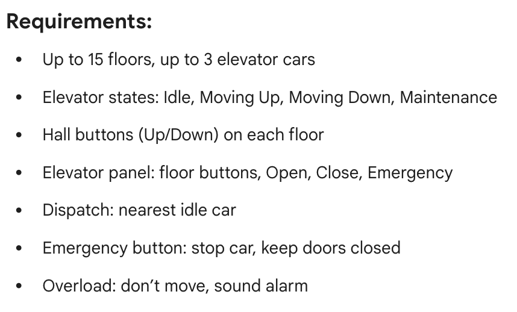

---

## Story Time

Before jumping into diagrams or code, we write a simple story describing how the system works in real life.

While writing this story, we follow one simple rule:

- **Nouns** represent classes
- **Verbs** (action words) represent methods

This story helps us understand the complete flow without thinking about implementation details.

---


---

From the story above, we can identify the following key entities:

- Passenger
- Building
- Floor
- HallPanel / HallButton
- ElevatorSystem
- ElevatorCar
- ElevatorPanel / ElevatorButton
- Door
- Display

These entities give us a clear idea of the core objects that will later turn into classes. The story also makes it clear which actions are done by the passenger and which are handled by the system.

---

## Sequence Diagram

In the story section, we described the complete elevator journey as a sequence of actions from the moment a passenger presses a hall button until they reach their destination floor.

In this section, we represent the same story using a sequence diagram by breaking it into clear system activities such as calling the elevator, dispatching a car, moving, stopping, and opening doors.

Each boxed section represents one activity, and the arrows show how different components interact in order. Together, these activities visually represent the full elevator flow described in the story.

---

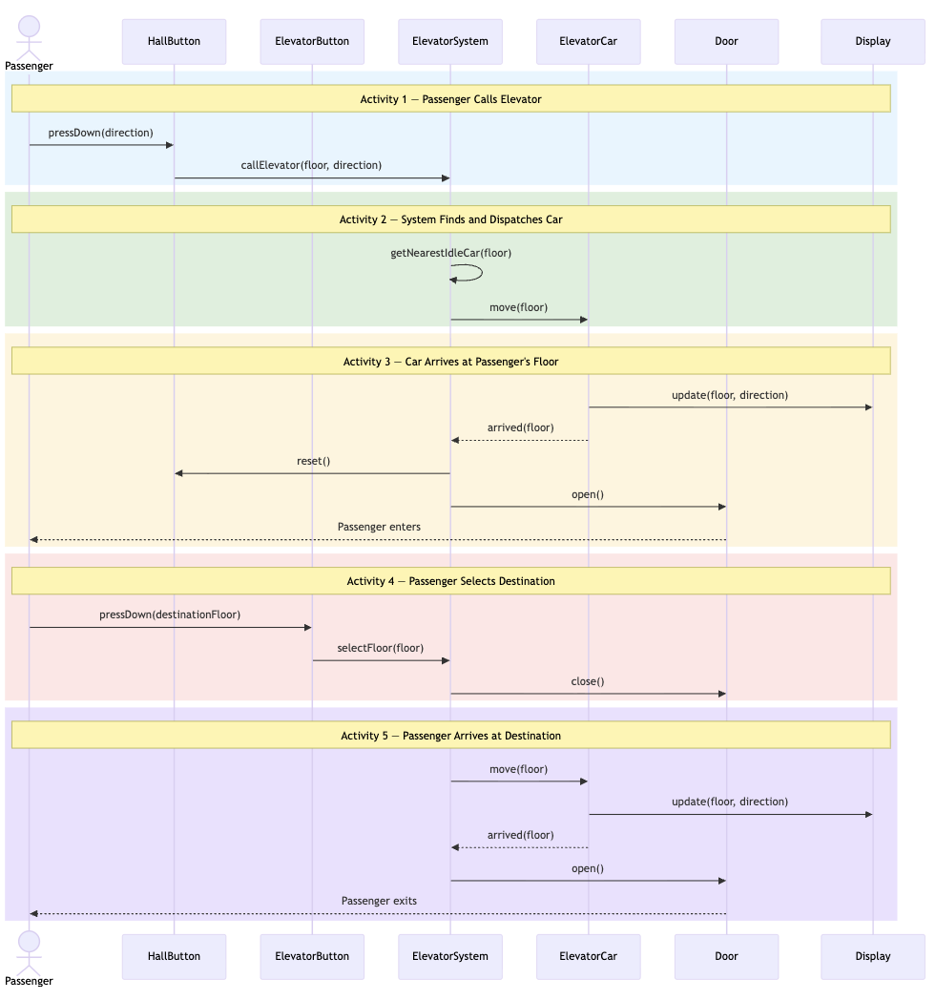

---

If you look closely at the diagram, you'll notice that **ElevatorSystem is the orchestrator**. The system controls everything. It tells the car to move, it opens/closes the door, it resets the hall button. The car never opens its own door or decides when to move. This is consistent with the **Single Responsibility Principle**: the car's job is to move between floors, and the system's job is to coordinate the full flow.

But there's a problem. Look at Activity 2. The system has `getNearestIdleCar()` as its own internal method. The dispatching algorithm (the logic that decides *which car* to send) lives inside `ElevatorSystem`. What if this algorithm needs to change?

- Today: Nearest idle car
- Tomorrow: Least busy car, directional preference, peak-hour optimization
- Maybe even: Different algorithms for different times of day

If we change the algorithm, we have to modify `ElevatorSystem` itself. That means `ElevatorSystem` has **two reasons to change**: coordination logic *and* dispatching algorithm. This violates the **Single Responsibility Principle**.

The solution: Extract the dispatching algorithm into its own class using the **Strategy Pattern**. The `ElevatorSystem` delegates the "which car?" decision to a `DispatchStrategy`, and never needs to change when the algorithm changes. We will learn more about why we used strategy pattern here in more detail in the next section.

Here is the updated sequence diagram with `DispatchStrategy` introduced:

---

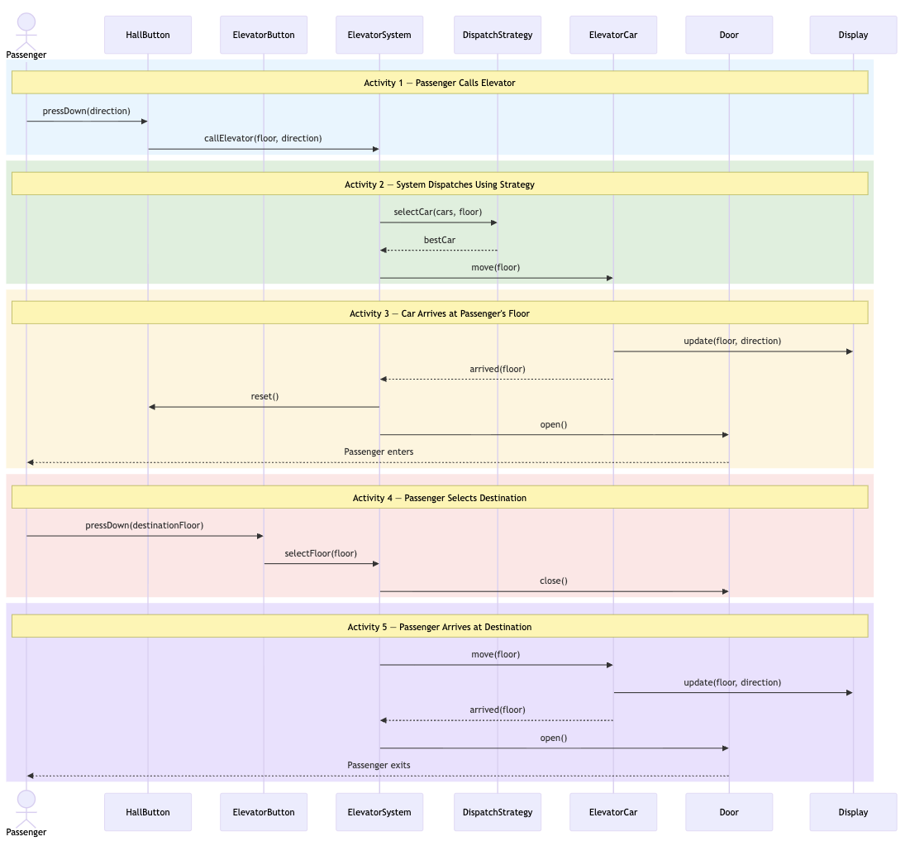

---

The only difference between the two diagrams is Activity 2. In the first diagram, `ElevatorSystem` finds the car internally. In the second, it delegates to `DispatchStrategy`. Everything else remains the same. This is the power of the Strategy Pattern. You swap one piece without touching the rest.

> **Something to remember:** If a class is doing more than one job, it has more than one reason to change. That's a sign you need to split it. Ask yourself: "If I change this logic, should the rest of the class care?" If the answer is no, it belongs in its own service.

---

The two diagrams above cover the **happy path** where everything goes smoothly. But our story also described what happens when things go wrong: overload, emergency, and maintenance. These edge cases need their own sequence diagram.

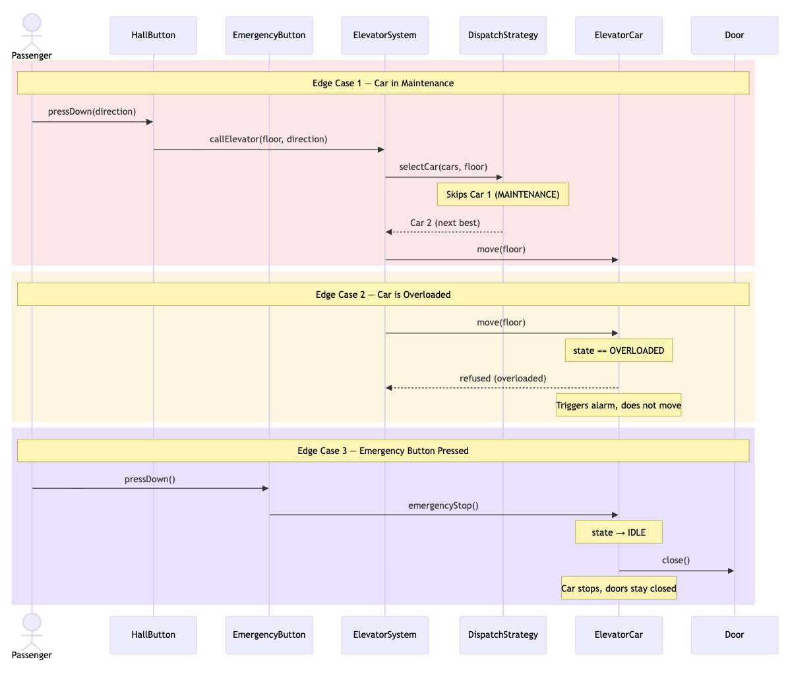

---

Look at what's happening in this diagram. The same `ElevatorCar` object appears in all three edge cases, but it **behaves completely differently** each time:

- In **Edge Case 1**, the car is in MAINTENANCE, the dispatch strategy skips it entirely. It doesn't even get called.
- In **Edge Case 2**, the system calls `move()` on the car, but the car **refuses** because it's overloaded. Same method, opposite behavior.
- In **Edge Case 3**, `emergencyStop()` is called and the car immediately stops and closes its doors.

The car's response to the same methods changes based on its internal state. This is the observation that leads us to the **State Pattern**, which we'll discuss in detail in the next section.

---

## How Sequence Diagrams Help Identify Design Patterns

Sequence diagrams don't just show flow. If you observe them carefully, they help you reason about design decisions and spot patterns that keep appearing across different LLD problems.

Let's go pattern by pattern and connect them with real thinking.

---

## Design Patterns Identified

### 1. One Central System Controls the Flow

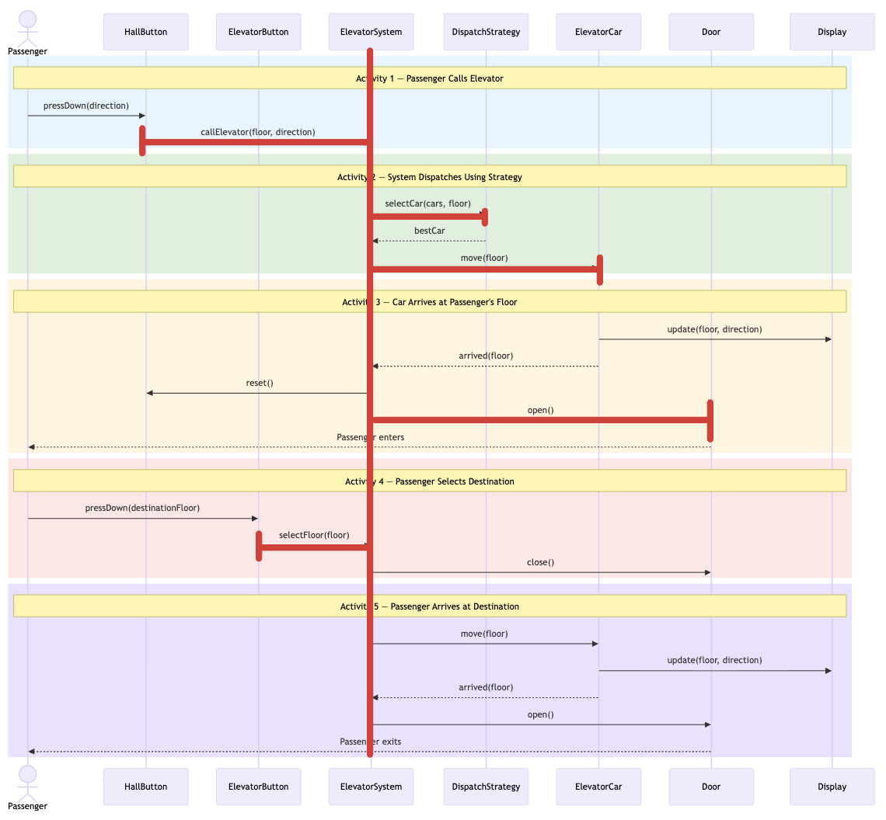

**What we see in the diagram?**

- Passenger talks to HallButton / ElevatorButton
- Both buttons signal ElevatorSystem
- ElevatorSystem orchestrates everything: dispatches cars, tells them to move, opens/closes doors, resets buttons
- All other components (ElevatorCar, Door, Display) respond to what ElevatorSystem tells them

**Observation:** Every decision flows through ElevatorSystem. No other component independently decides which car should go where, or when to open a door.

**Why this matters?** Without a central controller, problems arise:

- Multiple hall buttons could try to dispatch the same car simultaneously
- Each floor managing its own car assignment leads to inconsistent state
- Concurrent requests cause race conditions

The solution: One object manages the shared state. All operations go through it.

> 💡 **LLD Recall:** When many components depend on the same data, keep one central system in charge. (often implemented using **Singleton**)

> **Singleton:** Use Singleton when only one object should exist and everyone in the program uses that same object.

---

### 2. The Dispatching Algorithm Can Change

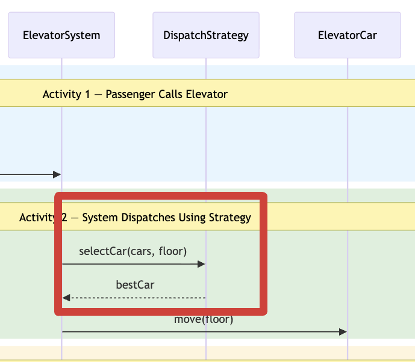

**What we see in the diagram?**

In the first (naive) diagram, ElevatorSystem calls `getNearestIdleCar()` on itself. In the improved diagram, it delegates to `DispatchStrategy`.

**Observation:** The dispatching logic is a responsibility that changes independently from the coordination flow.

**Why this matters?** Dispatching algorithms evolve frequently:

- Start with: Nearest idle car
- Later: Least busy car, directional preference, peak-hour optimization
- Maybe even: Different algorithms for different times of day

If dispatching logic lives inside `ElevatorSystem`:

```python
# Dispatcher is a method inside ElevatorSystem class
def dispatcher(self, floor):
    # What if this algorithm changes?
    best = None
    min_dist = float('inf')
    for car in self.cars:
        dist = abs(car.get_current_floor() - floor)
        if dist < min_dist:
            best = car
    return best
```

Every algorithm change forces modification of `ElevatorSystem`. This breaks the **Single Responsibility Principle.** `ElevatorSystem` now has to change for coordination reasons and for algorithm reasons. It also violates the **Open-Closed Principle**, since you're modifying existing code instead of extending it with new behavior.

The solution: Separate strategies that can be swapped.

```python
class DispatchStrategy(ABC):
    @abstractmethod
    def select_car(self, cars, floor):
        pass

class NearestIdleStrategy(DispatchStrategy): ...
class LeastBusyStrategy(DispatchStrategy): ...
```

Now:

- Want a new algorithm? Create a new strategy class
- Want to switch at runtime? Change the strategy
- ElevatorSystem never changes

> 💡 **LLD Recall:** When algorithms vary and change independently from the main flow, encapsulate them as strategies. (often implemented using **Strategy Pattern**)

> **Strategy:** Use Strategy when you have multiple ways to do the same task, and you want to switch between them easily.

---

### 3. The Elevator Car Changes Behavior Based on Its State

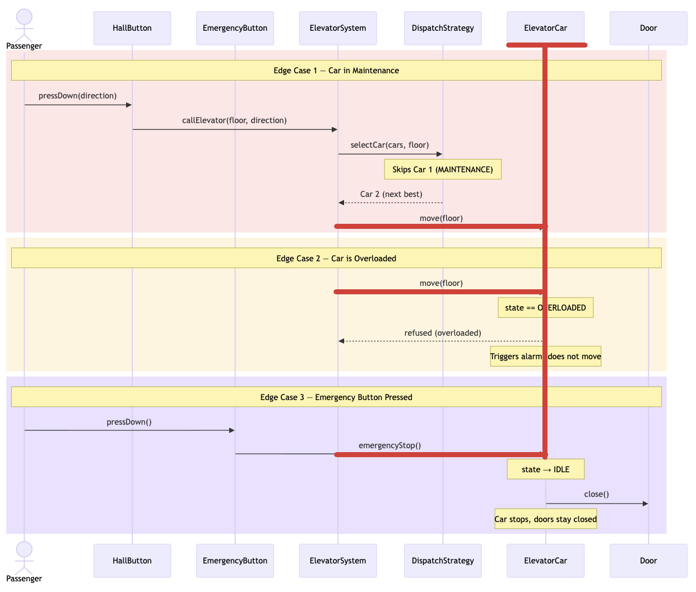

**What we see in the diagram?**

Look at Sequence Diagram 3 (Edge Cases). The same `ElevatorCar` object appears across all three scenarios, but responds completely differently each time:

- **Edge Case 1 (Maintenance):** The car is in MAINTENANCE state. The DispatchStrategy skips it entirely. It never even receives a `move()` call.
- **Edge Case 2 (Overloaded):** The system calls `move()` on the car, but the car **refuses to move** and triggers an alarm instead. Same method call as the happy path, completely opposite behavior.
- **Edge Case 3 (Emergency):** `emergencyStop()` is called. The car immediately stops and closes its doors regardless of what it was doing before.

Now compare this with the happy path (Sequence Diagram 1 & 2). In Activities 2, 3, and 5, when `move()` is called on an IDLE car, it moves smoothly, updates the display, and arrives.

**Observation:** The same method `move()` does completely different things depending on the car's internal state. When IDLE, it moves. When OVERLOADED, it refuses. When in MAINTENANCE, it's not even considered.

**Why this matters?** Without a clean way to handle states, you'd write:

```python
# Inside ElevatorCar class
def move(self, target):
    if self.state == "IDLE":
        # start moving to target
    elif self.state == "UP":
        # already moving, queue it
    elif self.state == "MAINTENANCE":
        # ignore everything
    elif self.state == "OVERLOADED":
        # refuse to move, trigger alarm
```

Problems:

- Adding a new state (like "EMERGENCY") requires modifying every method that checks state
- The logic for each state is scattered across multiple if-else chains
- It's easy to forget a state in one of the methods

The solution: Represent each state as its own object and let the car delegate behavior to its current state.

> 💡 **LLD Recall:** When you find yourself writing `if state == X: do this, elif state == Y: do that` inside the **same method** of a class and this pattern repeats across **multiple methods.** That's the State pattern knocking. Each state deserves its own class. (often implemented using **State Pattern**)

> **State Pattern:** Use the State pattern when an object has multiple states and its behavior changes dramatically across those states.

**However**, in our simplified implementation, we will use a simple enum for state and handle the logic with conditionals inside `ElevatorCar`. The State pattern is the "right" design for this, and you should mention it in an interview, but for a clean and short implementation, the enum approach works well enough.

> 🍕 **Food for thought:** If you had 6+ states each with 5+ methods behaving differently, the State pattern becomes essential. For our 4 states with relatively simple behavior, the enum approach keeps the code concise without sacrificing clarity. See [Appendix A](#appendix-a--state-pattern-implementation) for how the full State pattern implementation would look.

---

### Patterns Summary

| When You See This in Future Designs                                       | Use This Pattern    | Because                                                            |
| ------------------------------------------------------------------------- | ------------------- | ------------------------------------------------------------------ |
| Multiple components need to access/modify shared data                     | **Singleton** | Prevents inconsistent state and ensures a single source of truth   |
| Algorithms vary and change independently from the main flow               | **Strategy**  | Isolates changing behavior from stable flow                        |
| `if state == X` / `elif state == Y` repeating across multiple methods | **State**     | Each state becomes its own class. No more scattered if/elif chains |

---

## Code Implementation

### Phase 1: Nouns → Classes

From the story we clearly see these nouns:

- ElevatorSystem
- Building
- Floor
- HallPanel / HallButton
- ElevatorCar
- ElevatorPanel / ElevatorButton
- Door
- Display

From the sequence diagram analysis, we introduced one more:

- DispatchStrategy

From the interviewer discussion, we know there are different types of buttons (HallButton, ElevatorButton, DoorButton, EmergencyButton) that share common behavior (pressed state, press/reset actions). We use an abstract `Button` base class for this.

We also need enums for:

- **ElevatorState:** IDLE, UP, DOWN, MAINTENANCE
- **Direction:** UP, DOWN, IDLE
- **DoorState:** OPEN, CLOSED

---

#### Enums

```python
from enum import Enum

class ElevatorState(Enum):
    IDLE = 1
    UP = 2
    DOWN = 3
    MAINTENANCE = 4

class Direction(Enum):
    UP = 1
    DOWN = 2
    IDLE = 3

class DoorState(Enum):
    OPEN = 1
    CLOSED = 2
```

---

#### 1. Button (Abstract base for all buttons)

```python
class Button:
    def __init__(self):
        self.pressed = False

    def press_down(self):
        self.pressed = True

    def reset(self):
        self.pressed = False

    def is_pressed(self):
        raise NotImplementedError("Must be implemented by subclasses")
```

---

#### 2. HallButton (Floor buttons: Up/Down)

```python
class HallButton(Button):
    def __init__(self, direction):
        super().__init__()
        self.direction = direction

    def get_direction(self):
        return self.direction

    def is_pressed(self):
        return self.pressed
```

---

#### 3. ElevatorButton (Floor selection buttons inside the car)

```python
class ElevatorButton(Button):
    def __init__(self, floor):
        super().__init__()
        self.destination_floor = floor

    def get_destination_floor(self):
        return self.destination_floor

    def is_pressed(self):
        return self.pressed
```

---

#### 4. DoorButton and EmergencyButton

```python
class DoorButton(Button):
    def is_pressed(self):
        return self.pressed

class EmergencyButton(Button):
    def is_pressed(self):
        return self.pressed
```

---

#### 5. Door

```python
class Door:
    def __init__(self):
        self.state = DoorState.CLOSED

    def open(self):
        self.state = DoorState.OPEN

    def close(self):
        self.state = DoorState.CLOSED

    def is_open(self):
        return self.state == DoorState.OPEN
```

---

#### 6. Display

```python
class Display:
    def __init__(self):
        self.floor = 0
        self.direction = Direction.IDLE
        self.state = ElevatorState.IDLE

    def update(self, floor, direction, state):
        self.floor = floor
        self.direction = direction
        self.state = state

    def show(self, car_id):
        print(f"Elevator {car_id} | Floor: {self.floor} | Direction: {self.direction.name} | State: {self.state.name}")
```

---

#### 7. HallPanel and ElevatorPanel

```python
class HallPanel:
    def __init__(self, floor_number, top_floor):
        self.up = None if floor_number == top_floor else HallButton(Direction.UP)
        self.down = None if floor_number == 0 else HallButton(Direction.DOWN)

    def get_up_button(self):
        return self.up

    def get_down_button(self):
        return self.down
```

```python
class ElevatorPanel:
    def __init__(self, num_floors):
        self.floor_buttons = [ElevatorButton(i) for i in range(num_floors)]
        self.open_button = DoorButton()
        self.close_button = DoorButton()
        self.emergency_button = EmergencyButton()
```

---

#### 8. ElevatorCar

```python
class ElevatorCar:
    pass  # will fill in Phase 2
```

---

#### 9. Floor

```python
class Floor:
    def __init__(self, floor_number, top_floor):
        self.floor_number = floor_number
        self.panel = HallPanel(floor_number, top_floor)
        self.display = Display()

    def get_floor_number(self):
        return self.floor_number

    def get_panel(self):
        return self.panel

    def get_display(self):
        return self.display
```

---

#### 10. Building

```python
class Building:
    def __init__(self, num_floors, num_cars):
        top_floor = num_floors - 1
        self.floors = [Floor(i, top_floor) for i in range(num_floors)]
        self.cars = [ElevatorCar(i, num_floors) for i in range(num_cars)]

    def get_floors(self):
        return self.floors

    def get_cars(self):
        return self.cars
```

---

#### 11. DispatchStrategy and ElevatorSystem

```python
class DispatchStrategy(ABC):
    pass  # will fill in Phase 2

class ElevatorSystem:
    pass  # will fill in Phase 2
```

---

### Phase 2: Walk Through the Sequence Diagram and Write Code

Now that we have our empty classes and we've identified the design patterns, let's write real code.

The idea is simple: **open the sequence diagram and read it top to bottom**. Every time we see a new interaction, we write the code for it. And whenever we run into something that matches one of the design patterns we identified earlier, we apply that pattern right there.

---

#### Step 1: Passenger Calls Elevator (Activity 1)

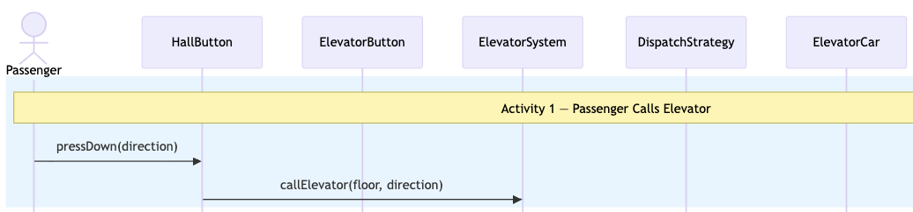

The first thing we see in the diagram is: a Passenger presses a HallButton, and the request reaches ElevatorSystem.

But wait! We identified in the Design Patterns section that all requests should go through the same ElevatorSystem. That's the **Singleton** pattern. So before anything else, we need ElevatorSystem to be a Singleton.

We also identified that dispatching logic should be a separate **Strategy**. So ElevatorSystem needs to accept a `DispatchStrategy` when it's created.

Let's set that up:

```python
from collections import deque

class FloorRequest:
    def __init__(self, floor, direction):
        self.floor = floor
        self.direction = direction

class ElevatorSystem:
    _instance = None

    def __init__(self, num_floors, num_cars, dispatch_strategy):
        if ElevatorSystem._instance is not None:
            raise Exception("ElevatorSystem is a Singleton. Use get_instance() instead.")
        self.building = Building(num_floors, num_cars)
        self.dispatch_strategy = dispatch_strategy
        self.hall_requests = deque()
        ElevatorSystem._instance = self

    @staticmethod
    def get_instance(num_floors=None, num_cars=None, dispatch_strategy=None):
        if ElevatorSystem._instance is None:
            ElevatorSystem(num_floors, num_cars, dispatch_strategy)
        return ElevatorSystem._instance

    def get_cars(self):
        return self.building.get_cars()

    def call_elevator(self, floor, direction):
        self.hall_requests.append(FloorRequest(floor, direction))
```

The `call_elevator()` method is exactly what we see in Activity 1: the HallButton signals the system with a floor and direction. But instead of handling it immediately, the system queues the request into `hall_requests`. Why a queue? Because multiple passengers on different floors can press hall buttons at the same time. The system needs to process them one by one in the order they arrived. The `FloorRequest` object simply bundles the floor number and direction together so the queue has all the information it needs to dispatch later.

---

#### Step 2: System Finds and Dispatches Car (Activity 2)

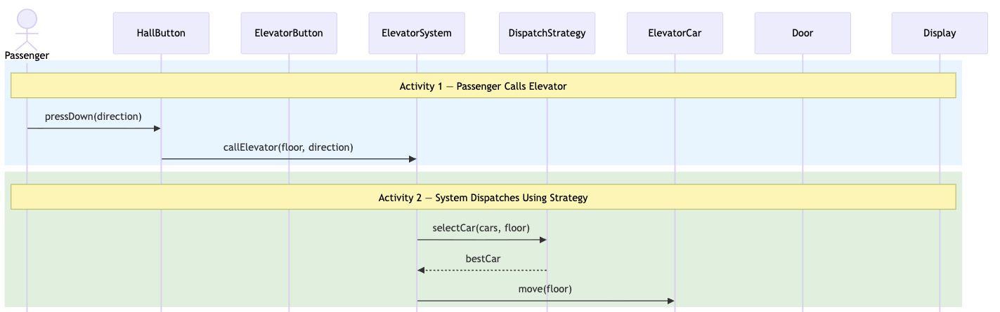

Moving down the diagram. After ElevatorSystem receives the request, it delegates the "which car?" decision to the `DispatchStrategy`.

```python
from abc import ABC, abstractmethod

class DispatchStrategy(ABC):
    @abstractmethod
    def select_car(self, cars, floor):
        pass

class NearestIdleStrategy(DispatchStrategy):
    def select_car(self, cars, floor):
        best = None
        min_dist = float('inf')
        for car in cars:
            if (car.get_state() == ElevatorState.IDLE
                and not car.is_in_maintenance()
                and not car.is_overloaded()):
                dist = abs(car.get_current_floor() - floor)
                if dist < min_dist:
                    min_dist = dist
                    best = car
        return best
```

Tomorrow if you need a least-busy algorithm or a directional-preference algorithm, you create a new class that implements `DispatchStrategy`. You don't touch `ElevatorSystem` or `NearestIdleStrategy`.

Now the dispatcher in `ElevatorSystem` uses this strategy:

```python
    def dispatcher(self):
        while self.hall_requests:
            req = self.hall_requests.popleft()
            car = self.dispatch_strategy.select_car(
                self.building.get_cars(), req.floor
            )
            if car is None:
                self.hall_requests.append(req)
                break
            car.move(req.floor)
            # Car has arrived. Reset the hall button and open the door
            hall_panel = self.building.get_floors()[req.floor].get_panel()
            if req.direction == Direction.UP and hall_panel.get_up_button():
                hall_panel.get_up_button().reset()
            elif req.direction == Direction.DOWN and hall_panel.get_down_button():
                hall_panel.get_down_button().reset()
            car.get_door().open()
```

Notice how the **system** tells the car to move, resets the hall button once the car arrives, and opens the door. The car doesn't orchestrate its own lifecycle. The system handles everything.

---

#### Step 3: Car Arrives at Passenger's Floor (Activity 3)

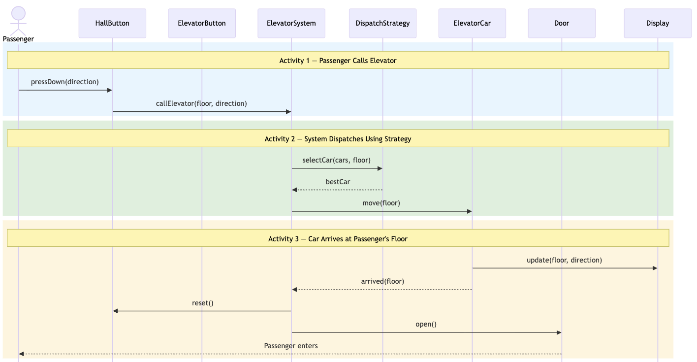

In Activity 2, the system told the car to `move()`. Now we need to write the `ElevatorCar` class that handles this movement. The car moves floor by floor, updating its display along the way. When it arrives, the system resets the hall button and opens the door. The car does **not** open its own door. That's the system's job.

```python
class ElevatorCar:
    MAX_LOAD = 680  # kg

    def __init__(self, car_id, num_floors):
        self.id = car_id
        self.current_floor = 0
        self.state = ElevatorState.IDLE
        self.door = Door()
        self.display = Display()
        self.panel = ElevatorPanel(num_floors)
        self.load = 0
        self.overloaded = False
        self.maintenance = False
        self.update_display()

    def get_id(self):
        return self.id

    def get_current_floor(self):
        return self.current_floor

    def get_state(self):
        return self.state

    def get_door(self):
        return self.door

    def get_display(self):
        return self.display

    def is_in_maintenance(self):
        return self.maintenance

    def is_overloaded(self):
        return self.overloaded

    def move(self, target):
        if self.maintenance or self.overloaded:
            return

        if target == self.current_floor:
            self.state = ElevatorState.IDLE
            self.update_display()
            return

        self.state = ElevatorState.UP if target > self.current_floor else ElevatorState.DOWN

        while self.current_floor != target:
            self.current_floor += 1 if self.state == ElevatorState.UP else -1
            self.update_display()

        self.state = ElevatorState.IDLE
        self.update_display()

    def update_display(self):
        if self.state == ElevatorState.UP:
            direction = Direction.UP
        elif self.state == ElevatorState.DOWN:
            direction = Direction.DOWN
        else:
            direction = Direction.IDLE
        self.display.update(self.current_floor, direction, self.state)
```

Notice: `move()` just moves and stops. It doesn't open any door or reset any button. Back in Step 2, the `dispatcher()` method handles the full Activity 3 flow: it calls `car.move(req.floor)`, then resets the hall button with `reset()`, and finally opens the door with `car.get_door().open()`. The system stays in control of everything that happens on arrival.

---

#### Step 4: Passenger Selects Destination (Activity 4)

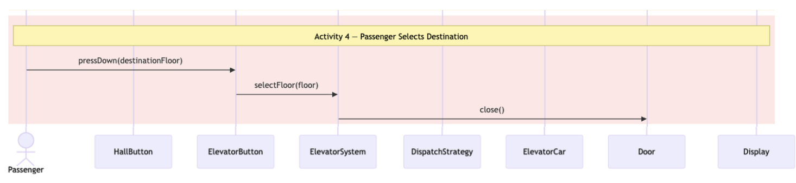

The passenger is now inside the car. They press an ElevatorButton for their desired floor. The ElevatorButton signals the ElevatorSystem, and the system takes over: it closes the door and tells the car to move.

```python
    # Inside ElevatorSystem class
    def select_floor(self, car, floor):
        """Called when a passenger presses an ElevatorButton inside the car."""
        car.get_door().close()
        car.move(floor)
```

Same pattern as before. The system orchestrates the flow. The car just moves when told.

---

#### Step 5: Car Arrives at Destination (Activity 5)

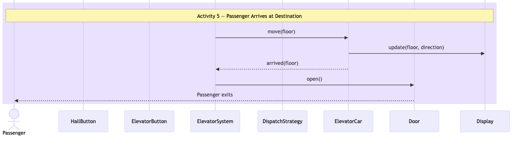

The car moves to the destination floor (reusing the same `move()` we wrote in Step 3), updates its display along the way, and when it arrives, the system opens the door. The passenger exits.

```python
    # Inside ElevatorSystem class (continuation of select_floor)
    def select_floor(self, car, floor):
        """Called when a passenger presses an ElevatorButton inside the car."""
        car.get_door().close()
        car.move(floor)
        car.get_door().open()
```

No new code was needed for the car itself. `move()` already handles everything. We just added `car.get_door().open()` after the move completes. This is the power of writing clean, reusable methods: Activity 5 reuses Activity 3's code entirely.

---

#### Step 6: Maintenance, Overload, and Emergency (Edge Cases: Sequence Diagram 3)


The happy path is done. Now we move to Sequence Diagram 3, which covers what happens when things go wrong. These are the state-dependent behaviors we identified in the Design Patterns section. Each one changes how the car responds:

```python
    # Inside ElevatorCar class
    def enter_maintenance(self):
        self.maintenance = True
        self.state = ElevatorState.MAINTENANCE
        self.door.close()
        self.update_display()

    def exit_maintenance(self):
        self.maintenance = False
        self.state = ElevatorState.IDLE
        self.update_display()

    def add_load(self, kg):
        self.load += kg
        if self.load > ElevatorCar.MAX_LOAD:
            self.overloaded = True
            print(f"ALARM: Elevator {self.id} is overloaded! Current load: {self.load} kg (max: {ElevatorCar.MAX_LOAD} kg). Elevator will not move.")

    def remove_load(self, kg):
        self.load -= kg
        if self.load <= ElevatorCar.MAX_LOAD:
            self.overloaded = False
            print(f"Elevator {self.id} overload cleared. Current load: {self.load} kg.")

    def emergency_stop(self):
        self.state = ElevatorState.IDLE
        self.door.close()
        self.update_display()
        print(f"EMERGENCY: Elevator {self.id} stopped. Doors closed. Alert sent.")
```

Notice how `move()` (from Step 3) already handles maintenance and overload. It checks `if self.maintenance or self.overloaded: return`. The methods here just change the car's state. The behavior difference comes from the same `move()` method responding differently based on state. This is exactly the observation that led us to the **State Pattern**.

---

And that's it! We walked the sequence diagrams from top to bottom:

- **Step 1:** Passenger → HallButton → ElevatorSystem receives request (applied **Singleton**)
- **Step 2:** ElevatorSystem → DispatchStrategy selects the best car (applied **Strategy**)
- **Step 3:** ElevatorCar moves to passenger's floor, system opens door on arrival
- **Step 4:** Passenger presses ElevatorButton → ElevatorSystem closes door and tells car to move
- **Step 5:** Car arrives at destination, system opens door. Reuses Step 3's `move()`
- **Step 6:** Maintenance / Overload / Emergency behaviors from Sequence Diagram 3 (state-driven, mentioned **State Pattern**)

Every pattern showed up naturally as we followed the flow. We didn't force them. We recognized them when we needed them.

---

## Let's Test Things Out

Let's put everything together and see the full flow in action:

```python
# Dependency Injection: we create the strategy outside
# and inject it into ElevatorSystem. Tomorrow if we want
# LeastBusyStrategy, we just change what we pass in.
dispatch_strategy = NearestIdleStrategy()
system = ElevatorSystem.get_instance(10, 3, dispatch_strategy)

# Scenario 1: Put elevator 3 in maintenance, then call from floor 5
car3 = system.get_cars()[2]
car3.enter_maintenance()

system.call_elevator(5, Direction.UP)
system.dispatcher()

# Take car 3 out of maintenance
car3.exit_maintenance()

# Scenario 2: Overload an elevator
car1 = system.get_cars()[0]
car1.add_load(700)  # exceeds 680 kg limit

system.call_elevator(3, Direction.DOWN)
system.dispatcher()  # car1 won't be dispatched since it's overloaded

# Scenario 3: Passenger rides elevator to a floor (Activity 4 & 5)
car2 = system.get_cars()[1]
system.select_floor(car2, 7)
```

---

## Appendix A: State Pattern Implementation

In the main design, we used a simple enum (`ElevatorState`) with conditionals inside `ElevatorCar` to handle state-dependent behavior. That works well for our 4 states. But what if the system grows? More states, more methods that behave differently per state. The if/elif chains multiply, and every new state forces you to touch every method.

Here's how the same `ElevatorCar` would look using the full State pattern.

---

### The State Interface

Every state must answer the same questions: what happens when the car is told to move? What happens on emergency? What happens when load is added?

```python
from abc import ABC, abstractmethod

class ElevatorCarState(ABC):
    @abstractmethod
    def move(self, car, target):
        pass

    @abstractmethod
    def emergency_stop(self, car):
        pass

    @abstractmethod
    def add_load(self, car, kg):
        pass
```

---

### Concrete States

Each state encapsulates its own behavior. No if/elif anywhere.

```python
class IdleState(ElevatorCarState):
    def move(self, car, target):
        if target == car.current_floor:
            return
        car.state_enum = ElevatorState.UP if target > car.current_floor else ElevatorState.DOWN
        while car.current_floor != target:
            car.current_floor += 1 if car.state_enum == ElevatorState.UP else -1
            car.update_display()
        car.state_enum = ElevatorState.IDLE
        car.update_display()

    def emergency_stop(self, car):
        car.door.close()
        car.transition_to(EmergencyState())

    def add_load(self, car, kg):
        car.load += kg
        if car.load > ElevatorCar.MAX_LOAD:
            car.transition_to(OverloadedState())


class OverloadedState(ElevatorCarState):
    def move(self, car, target):
        print(f"Car {car.id}: OVERLOADED. Refusing to move. Triggering alarm.")

    def emergency_stop(self, car):
        car.door.close()
        car.transition_to(EmergencyState())

    def add_load(self, car, kg):
        car.load += kg

    def remove_load(self, car, kg):
        car.load -= kg
        if car.load <= ElevatorCar.MAX_LOAD:
            car.transition_to(IdleState())


class MaintenanceState(ElevatorCarState):
    def move(self, car, target):
        print(f"Car {car.id}: In MAINTENANCE. Ignoring request.")

    def emergency_stop(self, car):
        print(f"Car {car.id}: In MAINTENANCE. Already out of service.")

    def add_load(self, car, kg):
        pass


class EmergencyState(ElevatorCarState):
    def move(self, car, target):
        print(f"Car {car.id}: EMERGENCY. Cannot move.")

    def emergency_stop(self, car):
        pass

    def add_load(self, car, kg):
        pass
```

---

### ElevatorCar with State Pattern

The car no longer checks its own state. It just delegates everything to the current state object.

```python
class ElevatorCar:
    MAX_LOAD = 680

    def __init__(self, car_id, num_floors):
        self.id = car_id
        self.current_floor = 0
        self.state_enum = ElevatorState.IDLE
        self.door = Door()
        self.display = Display()
        self.panel = ElevatorPanel(num_floors)
        self.load = 0
        self._state = IdleState()  # current state object
        self.update_display()

    def transition_to(self, new_state):
        self._state = new_state

    def move(self, target):
        self._state.move(self, target)

    def emergency_stop(self):
        self._state.emergency_stop(self)

    def add_load(self, kg):
        self._state.add_load(self, kg)

    def enter_maintenance(self):
        self.transition_to(MaintenanceState())
        self.state_enum = ElevatorState.MAINTENANCE
        self.door.close()
        self.update_display()

    def exit_maintenance(self):
        self.transition_to(IdleState())
        self.state_enum = ElevatorState.IDLE
        self.update_display()

    def update_display(self):
        if self.state_enum == ElevatorState.UP:
            direction = Direction.UP
        elif self.state_enum == ElevatorState.DOWN:
            direction = Direction.DOWN
        else:
            direction = Direction.IDLE
        self.display.update(self.current_floor, direction, self.state_enum)
```

---

### What Changed?

Compare the `move()` method in both approaches:

**Enum approach (what we used):**

```python
def move(self, target):
    if self.maintenance or self.overloaded:
        return
    # ... movement logic
```

**State pattern approach:**

```python
def move(self, target):
    self._state.move(self, target)  # that's it
```

The car doesn't check anything. It says "hey current state, handle this." Each state knows exactly what to do. `IdleState` moves. `OverloadedState` refuses. `MaintenanceState` ignores.

**When to upgrade to the State pattern:** If you add a new state like `FIRE_MODE` (car automatically goes to ground floor and opens doors), you just create a `FireModeState` class. You don't touch `ElevatorCar` or any existing state class. That's the **Open-Closed Principle** at work.
