# Parking Lot Low Level Design

# Problem Statement

Design a Parking Lot system that can handle different types of vehicles, assign parking spots, generate tickets, and calculate parking fees.

---

LLD is not about jumping straight into classes and code. As humans, we cannot think of all the requirements at once, and that is completely fine. That is why asking the right questions is an important part of Low Level Design. These questions help us understand what the system should do before we decide how to design it. Instead of assuming everything upfront, we start with the basics and correct our understanding step by step as the design evolves.

---

> ## **Interviewer ↔ Candidate Clarification**
>
> **Candidate:** What types of vehicles will the parking lot support?
> **Interviewer:** It will support three types of vehicles: Bike, Car, and Truck.
>
> **Candidate:** Okay. So will there be different parking spots for different vehicle types?
> **Interviewer:** Yes. Each vehicle type will have its own parking spot category: Compact, Regular, and Large.
>
> **Candidate:** When a vehicle enters the parking lot, is the ticket generated at entry or at exit?
> **Interviewer:** The ticket is generated at entry.
>
> **Candidate:** Okay. So ticket generation happens at entry, and payment is done at exit, right?
> **Interviewer:** Yes, that is correct.
>
> **Candidate:** What pricing model should we follow? Hourly or flat rate?
> **Interviewer:** We will use hourly pricing.
>
> **Candidate:** Got it. That means we need to track the time from entry to exit. So the ticket should store the entry time, which we can later use to calculate the parking duration.
> **Interviewer:** Yes.
>
> **Candidate:** What payment methods should we support for now?
> **Interviewer:** For now, cash payment is sufficient.
>
> **Candidate:** One more question. What happens if the parking lot is already full? We should not issue a ticket in that case, right?
> **Interviewer:** Yes. If there is no available parking spot, the system should not generate a ticket and should deny entry.

---

After the discussion, the candidate writes down only what is confirmed.

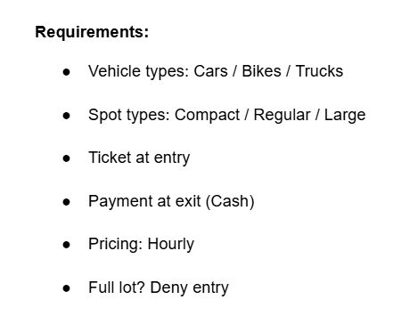

## Story Time

Before jumping into diagrams or code, we write a simple story describing how the system works in real life.

While writing this story, we follow one simple rule:

+ Nouns represent classes
+ Verbs (action words) represent methods

This story helps us understand the complete flow from entry to exit without thinking about implementation details.

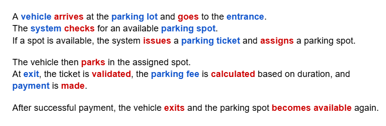


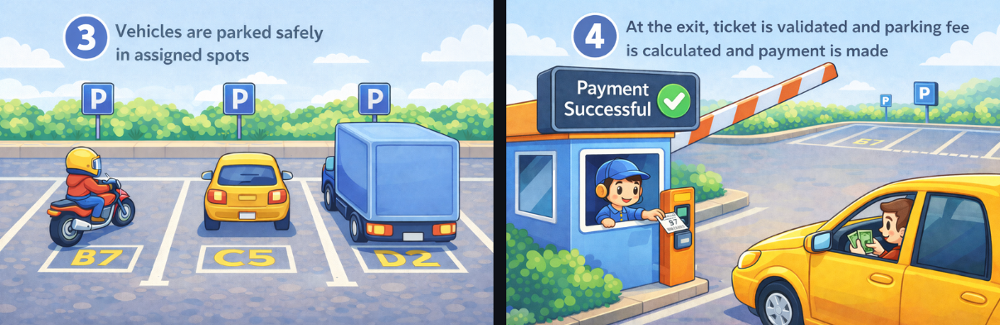

From the story above, we can identify the following key entities:

- Vehicle
- Parking Lot
- Parking Spot
- Parking Ticket
- Entrance
- Exit
- Payment

These entities give us a clear idea of the core objects that will later turn into classes.

The story also makes it clear which actions are done by the customer and which are handled by the system.
In the next section, we use this clarity to observe how the system components talk to each other during the flow.

---

# Sequence Diagram

In the story section, we described the complete parking journey as a sequence of actions that happen from the moment a vehicle arrives until it leaves.

In this section, we represent the same story using a sequence diagram by breaking it into **clear system activities** such as requesting entry, assigning a parking spot, calculating the fee, and releasing the spot.

Each boxed section represents one activity, and the arrows show how different components interact in order.

Together, these activities visually represent the full parking flow described in the story.

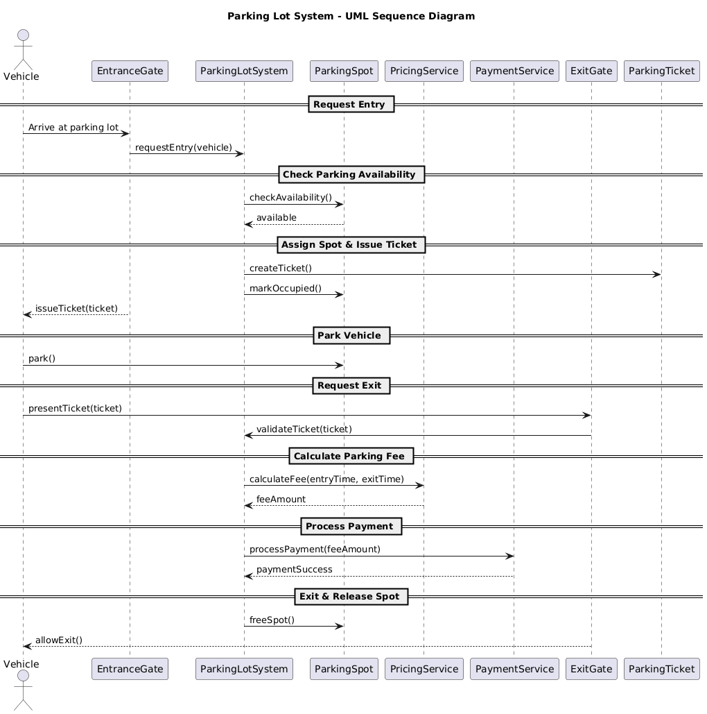

If you look closely at the diagram, you'll notice that **PricingService** and **PaymentService** appear as separate components. They were not part of our original story. We introduced them here because of the **Single Responsibility Principle.** Each class should have only one reason to change. ParkingLotSystem's job is to manage the parking flow: assign spots, issue tickets, and coordinate entry/exit. Pricing logic (hourly, flat rate, peak hours) and payment logic (cash, card, UPI) are entirely different responsibilities. If we put them inside ParkingLotSystem, then that one class would need to change whenever the parking flow changes, *or* the pricing model changes, *or* a new payment method is added. Those are three different reasons to change one class. By pulling them into their own services, each class has exactly one job and one reason to change.

> 🍕 **Food for thought:** If you are really interested, you should also think about bifurcating spot assignment and ticket creation out of ParkingLotSystem because those are different responsibilities too. But in order to keep things simple, we are not doing that here.

> **Something to remember:** If a class is doing more than one job, it has more than one reason to change and that's a sign you need to split it. Ask yourself: *"If I change this logic, should the rest of the class care?"* If the answer is no, it belongs in its own service.

## How Sequence Diagrams Help Identify Design Patterns

Sequence diagrams don’t just show flow.
If you observe them carefully, they help you reason about design decisions and spot patterns that keep appearing across different LLD problems.

Let’s go pattern by pattern and connect them with real thinking.

## Design Patterns Identified

## 1. One Central System Controls the Flow

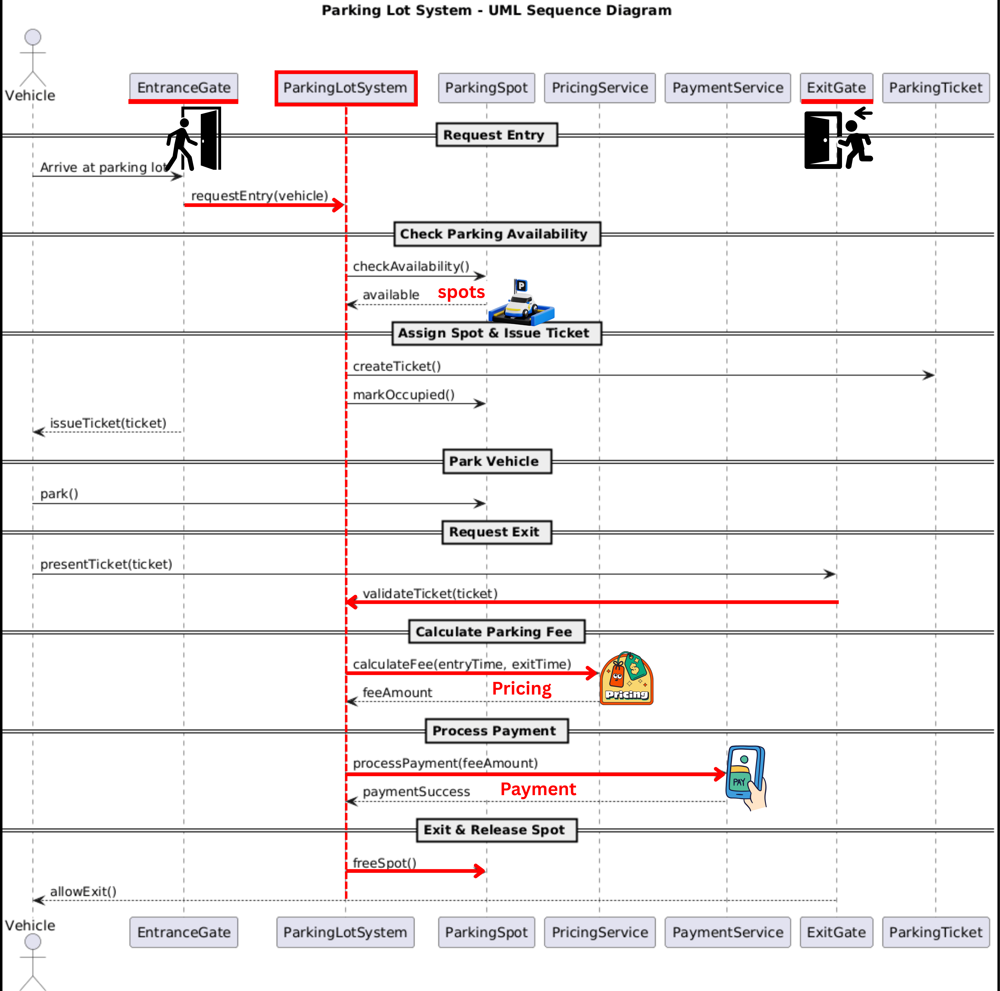

What we see in the diagram?

* Vehicle talks to EntranceGate
* EntranceGate forwards to ParkingLotSystem
* ParkingLotSystem orchestrates everything: checks spots, creates tickets, calculates fees, processes payments
* All other components (ParkingSpot, PricingService, PaymentService) respond to ParkingLotSystem's requests

**Observation:**
Every decision flows through ParkingLotSystem. No other component independently modifies parking state.

**Why this matters?** Without a central controller, problems arise:

- **Multiple entrance gates** could assign the same spot to different vehicles
- **Each gate with its own spot list** leads to inconsistent views of availability
- **Concurrent access** causes race conditions

**The solution:** One object manages shared data. All operations go through it.

> 💡 **LLD Recall**
> When many components depend on the same data, keep one central system in charge.
> (often implemented using Singleton)

> **Singleton**
> *Use Singleton when only one object should exist and everyone in the program uses that same object.*

---

## 2. Objects Are Created Only When Needed

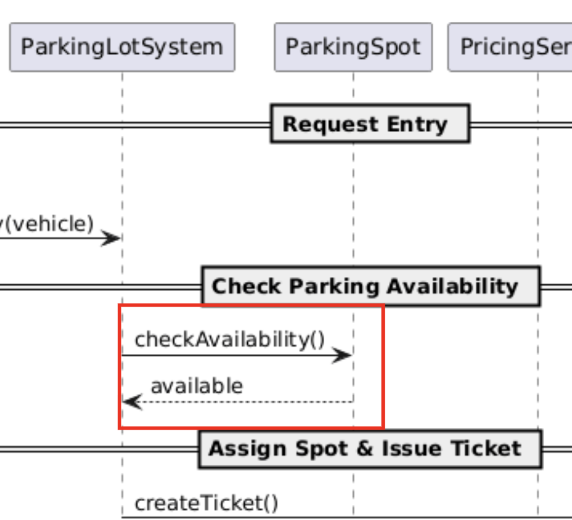

What we see in the diagram?

* System receives checkAvailability(vehicle) with the vehicle
* System must find the right type of spot:
  - Bike → Compact spot
  - Car → Regular spot
  - Truck → Large spot
* Spot type decision happens at runtime

**Observation:**
The exact spot type to create is determined dynamically based on vehicle type.

**Why this matters?**
Without a factory, you'd write:

```python
if vehicle.get_type() == "Bike":
    return CompactSpot()
elif vehicle.get_type() == "Car":
    return RegularSpot()
elif vehicle.get_type() == "Truck":
    return LargeSpot()
```

Problems:

- Adding new vehicle types (Bus, Motorcycle) requires modifying this code
- Adding new spot types (Premium, Disabled) requires more conditions
- Mapping logic scattered across the codebase
- This also breaks the **Open-Closed Principle.** Every time a new vehicle or spot type is introduced, you're going back and modifying existing code instead of simply extending it.

**The solution:** Centralize creation logic in a factory.

```python
class ParkingSpotFactory:
    @staticmethod
    def create_spot(vehicle_type):
        # Creation logic in one place
        pass
```

> 💡 **LLD Recall**
> If your code decides *which* object to create based on some condition (like vehicle type → spot type), put that decision in a **Factory**. One place to create, one place to change.

> **Factory Method**
> Use Factory when you don't know which exact object you need yet. Let the factory figure it out at runtime.

---

## 3. Rules Are Separate from the Main Flow

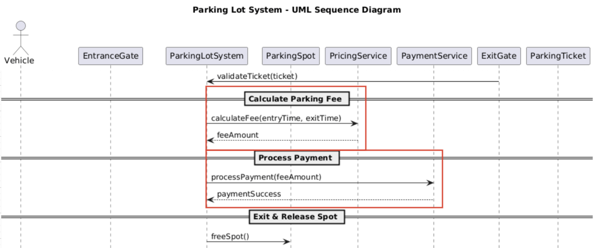

What we see in the diagram?

- System asks PricingService to calculate fees
- System asks PaymentService to process payments
- System doesn't contain pricing or payment logic itself

**Observation:**
Business rules are delegated to specialized services.

**Why this matters?** Rules evolve frequently:

- Pricing: Flat rate → First hour free → Peak/off-peak → Member discounts
- Payment: Cash → Cash + Card → Multiple payment methods → Subscriptions

If pricing logic lives in ParkingLotSystem:

```python
def handle_exit(self, ticket):
    hours = calculate_hours(ticket)
    fee = hours * 50  # What if this rule changes?
    # Process payment...
```

Every rule change forces modification of ParkingLotSystem. This breaks the **Single Responsibility Principle.** ParkingLotSystem now has to change for parking flow reasons *and* for pricing/payment rule changes. It also violates the **Open-Closed Principle**, since you're modifying existing code instead of extending it with new behavior.

**The solution:** Separate strategies that can be swapped.

```python
class PricingStrategy(ABC):
    @abstractmethod
    def calculate_fee(self, entry_time, exit_time):
        pass

class HourlyPricing(PricingStrategy): ...
class PeakHourPricing(PricingStrategy): ...
```

Now:

- Want weekend pricing? Create new strategy
- Want to switch at runtime? Change strategy
- ParkingLotSystem never changes

> 💡 **LLD Recall**
> When algorithms vary and change independently from the main flow, encapsulate them as strategies.
> (often implemented using Strategy Pattern)

> **Strategy**
> *Use Strategy when you have multiple ways to do the same task, and you want to switch between them easily.*

---

## Patterns Summary

| When You See This in Future Designs                                | Use This Pattern | Because                                                          |
| ------------------------------------------------------------------ | ---------------- | ---------------------------------------------------------------- |
| Multiple components need to access/modify shared data              | Singleton        | Prevents inconsistent state and ensures a single source of truth |
| Object types determined at runtime based on conditions             | Factory Method   | Centralizes creation logic and makes the system extensible       |
| Business rules/algorithms that change frequently and independently | Strategy         | Isolates changing behavior from stable flow                      |

# Code Implementation

## Phase 1: Nouns->Classes

From the story we clearly see these nouns:

- Vehicle
- ParkingLotSystem
- EntranceGate
- ParkingSpot
- ParkingTicket
- ExitGate
- PricingService
- PaymentService

From the interviewer discussion, we know there are different types of vehicles (Bike, Car, Truck) and each maps to a specific spot type (Compact, Regular, Large). Since the mapping is 1-to-1, we use a single enum for both:

```python
from enum import Enum

class VehicleType(Enum):
    BIKE = "BIKE"
    CAR = "CAR"
    TRUCK = "TRUCK"
```

A Bike goes to a Compact spot, a Car to Regular, a Truck to Large. But the type that connects them is the same. This avoids needing a separate mapping between two different enums.

> 🍕 **Food for thought:** We used a single enum because the mapping is currently 1-to-1. If your system needs spot types that don't map directly to vehicle types (e.g., VIP spots, disabled parking that accepts any vehicle), you'd want separate enums or an abstract class hierarchy for each. For this walkthrough, the single enum keeps things simple.

1) Vehicle (A vehicle arrives at the parking lot.)

```python
class Vehicle:
    def __init__(self, number: str, vehicle_type: VehicleType):
        self.number = number
        self.type = vehicle_type

    def get_number(self) -> str:
        return self.number

    def get_type(self) -> VehicleType:
        return self.type
```

2) ParkingLotSystem (The parking lot system manages parking spots and tickets.)

```python
class ParkingLotSystem:
    pass  # will fill later
```

3) EntranceGate (The entrance gate issues parking tickets.)

```python
class EntranceGate:
    pass  # entry-related behavior will go here
```

4) ParkingSpot (The vehicle parks in an assigned spot.)

> A parking spot stores its type and state: free or occupied.
> It should NOT make decisions.

```python
class ParkingSpot:
    def __init__(self, spot_id: int, spot_type: VehicleType):
        self.id = spot_id
        self.type = spot_type
        self.is_free = True

    def available(self) -> bool:
        return self.is_free

    def get_type(self) -> VehicleType:
        return self.type

    def mark_occupied(self):
        self.is_free = False

    def release(self):
        self.is_free = True

    def get_id(self) -> int:
        return self.id
```

5) ParkingTicket (The parking ticket records entry time and spot.)

```python
import time

class ParkingTicket:
    def __init__(self, vehicle: Vehicle, spot: ParkingSpot):
        self.vehicle = vehicle
        self.spot = spot
        self.entry_time = time.time()

    def get_vehicle(self) -> Vehicle:
        return self.vehicle

    def get_spot(self) -> ParkingSpot:
        return self.spot

    def get_entry_time(self) -> float:
        return self.entry_time
```

6) ExitGate, PricingStrategy, PaymentStrategy

```python
class ExitGate: pass
class PricingStrategy: pass
class PaymentStrategy: pass
```

## Phase 2: Walk Through the Sequence Diagram and Write Code

Now that we have our empty classes and we've identified the design patterns, let's write real code.

The idea is simple: **open the sequence diagram and read it top to bottom.** Every time we see a new interaction, we write the code for it. And whenever we run into something that matches one of the design patterns we identified earlier, we apply that pattern right there.

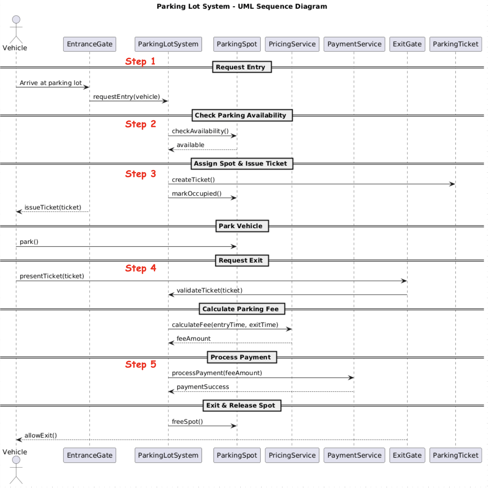

---

**Step 1: Vehicle Requests Entry at EntranceGate**

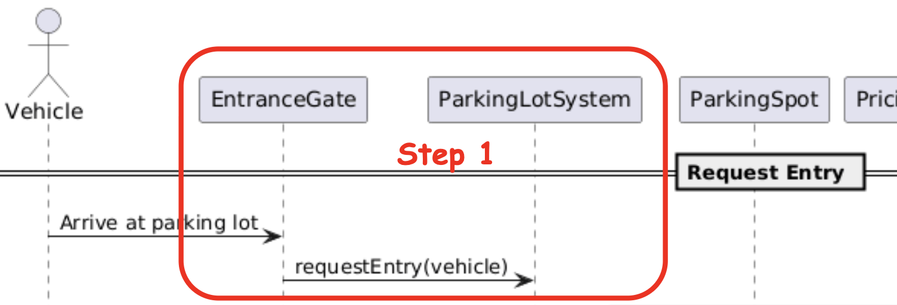

The first thing we see in the diagram is: a Vehicle arrives and talks to the EntranceGate. The EntranceGate doesn't do anything on its own. It just forwards the request to ParkingLotSystem.

But wait! We identified in the [Design Patterns section](#1-one-central-system-controls-the-flow) that all gates should talk to the **same** ParkingLotSystem. That's the Singleton pattern. So before writing the gate, we need ParkingLotSystem to be a Singleton.

Let's set that up first:

```python
class ParkingLotSystem:
    _instance = None

    def __init__(self, pricing_service: PricingStrategy, payment_service: PaymentStrategy):
        if ParkingLotSystem._instance is not None:
            raise Exception("ParkingLotSystem is a Singleton. Use get_instance() instead.")
        self.spots = []
        self.pricing_service = pricing_service
        self.payment_service = payment_service
        ParkingLotSystem._instance = self

    @staticmethod
    def get_instance(pricing_service=None, payment_service=None):
        if ParkingLotSystem._instance is None:
            ParkingLotSystem(pricing_service, payment_service)
        return ParkingLotSystem._instance

    def add_spot(self, spot: ParkingSpot):
        self.spots.append(spot)

    def handle_entry(self, vehicle: Vehicle):
        pass  # will fill in next steps

    def handle_exit(self, ticket: ParkingTicket):
        pass  # will fill in next steps
```

Now both EntranceGate and ExitGate can hold a reference to this single system:

```python
class EntranceGate:
    def __init__(self, system: ParkingLotSystem):
        self.system = system

    def enter(self, vehicle: Vehicle):
        return self.system.handle_entry(vehicle)


class ExitGate:
    def __init__(self, system: ParkingLotSystem):
        self.system = system

    def exit(self, ticket: ParkingTicket):
        self.system.handle_exit(ticket)
```

---

**Step 2: System Checks Availability and Assigns a Spot**

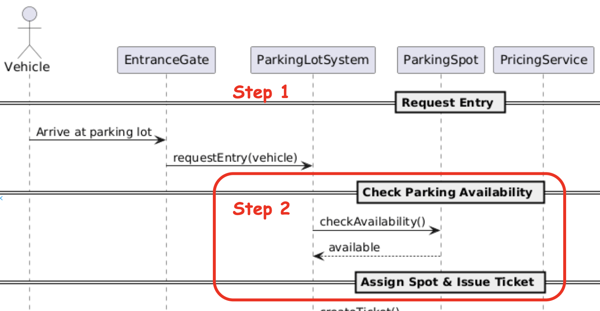

Moving down the diagram. After EntranceGate forwards the request, ParkingLotSystem needs to find an available spot. But not just any spot. A Bike can't park in a Large spot and a Truck can't squeeze into a Compact one. The system needs to find a spot that **matches the vehicle's type**.

This is where we recognize the [Factory pattern](#2-objects-are-created-only-when-needed) we identified earlier. The system needs to decide *which type of spot* to look for based on the vehicle type. Instead of writing if-else chains everywhere, we put that logic in one place: a `ParkingSpotFactory`:

```python
class ParkingSpotFactory:
    @staticmethod
    def get_spot_type(vehicle_type: VehicleType) -> VehicleType:
        # Since we use a single enum, the mapping is direct.
        # Bike -> BIKE spot (Compact), Car -> CAR spot (Regular), Truck -> TRUCK spot (Large)
        return vehicle_type
```

In the purest sense, this is not the classic Factory pattern because we are not creating a new object here. Factory is a creational pattern. But the core idea behind Factory still applies: centralizing the decision of "given some input, which type do I need?" in one place. If tomorrow this mapping evolves into actual object creation (e.g., creating different spot subclasses on the fly), this is exactly where it would happen.

Right now the mapping is 1-to-1, so it looks simple. But tomorrow if a new rule says "Bikes can also park in Car spots if Compact is full," this is the only place you'd change. One place to decide, one place to change.

Now the system uses this factory to find the right spot:

```python
def handle_entry(self, vehicle: Vehicle):
    required_type = ParkingSpotFactory.get_spot_type(vehicle.get_type())

    for spot in self.spots:
        if spot.available() and spot.get_type() == required_type:
            spot.mark_occupied()
            # next step: create a ticket

    return None  # no matching spot available
```

---

**Step 3: System Creates a Ticket**

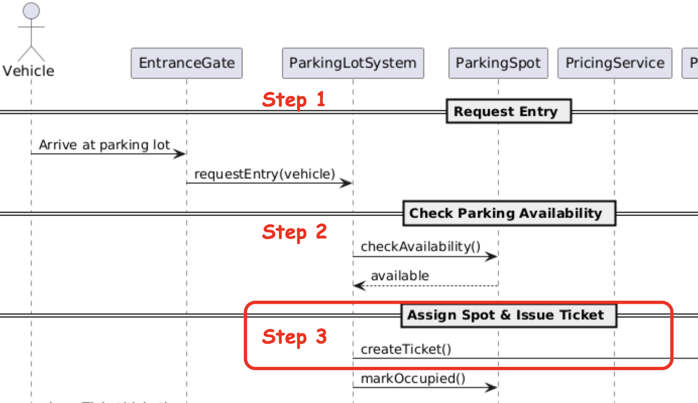

Once a matching spot is found and marked occupied, the diagram shows that the system creates a ParkingTicket. This is straightforward. A ticket is always the same object. It just records which vehicle, which spot, and the entry time. No runtime decision needed here, so a simple `new ParkingTicket()` is enough.

Let's put Steps 2 and 3 together inside `handleEntry()`:

```python
class ParkingLotSystem:
    # ... (same Singleton setup as Step 1)

    def handle_entry(self, vehicle: Vehicle):
        required_type = ParkingSpotFactory.get_spot_type(vehicle.get_type())

        for spot in self.spots:
            if spot.available() and spot.get_type() == required_type:
                spot.mark_occupied()
                return ParkingTicket(vehicle, spot)

        return None  # no matching spot available

    def handle_exit(self, ticket: ParkingTicket):
        pass  # will fill in next steps
```

---

**Step 4: Vehicle Exits and Fee Is Calculated**

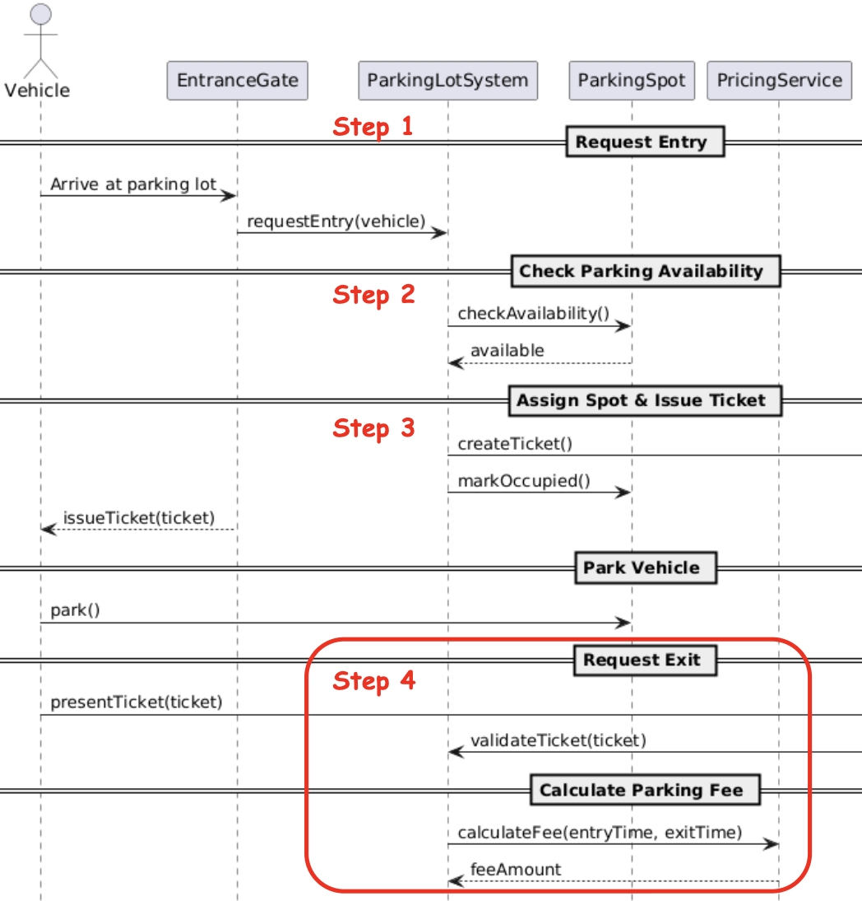

Now we move to the bottom half of the diagram i.e. the exit flow. The Vehicle goes to the ExitGate, which calls ParkingLotSystem's `handleExit()`. The first thing the system does is calculate the parking fee.

In the [Design Patterns section](#3-rules-are-separate-from-the-main-flow), we said pricing logic should live in its own service because pricing rules change independently. This is the Strategy pattern. But to make it a real Strategy, we need an **interface** that defines the contract, and then concrete classes that implement it. This way ParkingLotSystem depends on the interface, not on a specific pricing implementation.

Also, different spot types usually have different rates (a Truck in a Large spot costs more than a Bike in a Compact one), so the pricing method should also take the `VehicleType`.

First, the interface:

```python
from abc import ABC, abstractmethod

class PricingStrategy(ABC):
    @abstractmethod
    def calculate_fee(self, entry_time: float, exit_time: float, vehicle_type: VehicleType) -> int:
        pass
```

Now a concrete implementation for hourly pricing. Notice that we pass the rates as a dictionary instead of hardcoding if-else chains. Remember the OCP issue we discussed in the [Factory section](#2-objects-are-created-only-when-needed)? The same problem would show up here if we used conditionals on `VehicleType`. Adding a new vehicle type would force us to modify this method. With a config dictionary, we just update the config - `HourlyPricing` stays untouched.

```python
class HourlyPricing(PricingStrategy):
    def __init__(self, rates: dict):
        self.rates = rates  # {VehicleType.BIKE: 20, VehicleType.CAR: 50, ...}

    def calculate_fee(self, entry_time: float, exit_time: float, vehicle_type: VehicleType) -> int:
        hours = int((exit_time - entry_time) / 3600)
        if hours < 1:
            hours = 1
        return hours * self.rates[vehicle_type]
```

Tomorrow if you need weekend pricing or peak-hour pricing, you create a new class that implements `PricingStrategy`. You don't touch ParkingLotSystem or `HourlyPricing`.

---

**Step 5: Payment Is Processed and Spot Is Released**

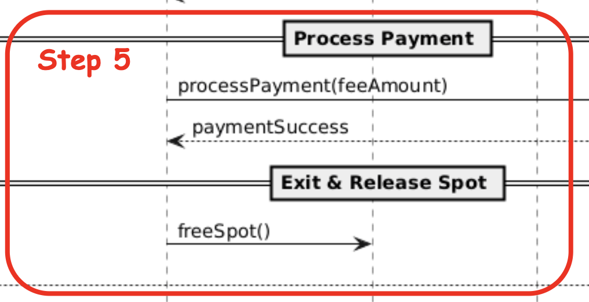

The last two things in the diagram: the system processes the payment, and if it succeeds, the spot is released. Same reasoning as pricing. Payment logic lives behind an interface (Strategy pattern):

```python
class PaymentStrategy(ABC):
    @abstractmethod
    def process_payment(self, amount: int) -> bool:
        pass
```

And a concrete implementation for cash payment:

```python
class CashPayment(PaymentStrategy):
    def process_payment(self, amount: int) -> bool:
        # assume cash payment for now
        return True
```

Now we can fill in the complete `handle_exit()` method. It delegates fee calculation to `PricingStrategy` and payment to `PaymentStrategy` exactly how the sequence diagram shows it. Notice we pass the vehicle type to the pricing service so it can charge the right rate:

```python
def handle_exit(self, ticket: ParkingTicket):
    fee = self.pricing_service.calculate_fee(
        ticket.get_entry_time(),
        time.time(),
        ticket.get_spot().get_type()
    )

    if self.payment_service.process_payment(fee):
        ticket.get_spot().release()
```

---

And that's it! we walked the sequence diagram from top to bottom:

- **Step 1:** Vehicle → EntranceGate → ParkingLotSystem *(applied Singleton)*
- **Step 2:** ParkingLotSystem → finds matching spot by vehicle type *(applied Factory)*
- **Step 3:** ParkingLotSystem → creates ParkingTicket *(simple creation)*
- **Step 4:** ParkingLotSystem → PricingService calculates fee *(applied Strategy)*
- **Step 5:** ParkingLotSystem → PaymentService processes payment, spot released *(applied Strategy)*

Every pattern showed up naturally as we followed the flow. We didn't force them. We recognized them when we needed them.

---

## Let's Test Things Out

Let's put everything together in `main()` and see the full flow in action:

```python
# Dependency Injection: we create the dependencies outside
# and inject them into ParkingLotSystem. Tomorrow if we want
# PeakHourPricing or CardPayment, we just change what we pass in.
rates = {VehicleType.BIKE: 20, VehicleType.CAR: 50, VehicleType.TRUCK: 100}
pricing_service = HourlyPricing(rates)
payment_service = CashPayment()

system = ParkingLotSystem.get_instance(pricing_service, payment_service)

# Add spots of different types
system.add_spot(ParkingSpot(1, VehicleType.BIKE))
system.add_spot(ParkingSpot(2, VehicleType.CAR))
system.add_spot(ParkingSpot(3, VehicleType.CAR))
system.add_spot(ParkingSpot(4, VehicleType.TRUCK))

entrance = EntranceGate(system)
exit_gate = ExitGate(system)

car = Vehicle("KA-01-1234", VehicleType.CAR)
bike = Vehicle("KA-05-9876", VehicleType.BIKE)

ticket1 = entrance.enter(car)
ticket2 = entrance.enter(bike)

if ticket1:
    exit_gate.exit(ticket1)

if ticket2:
    exit_gate.exit(ticket2)
```
