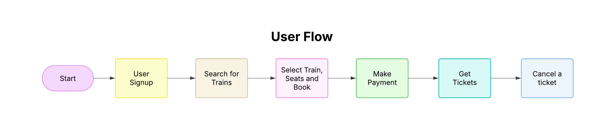
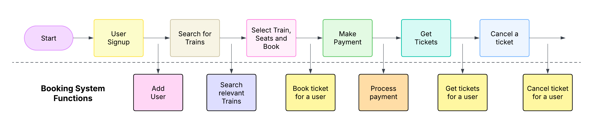
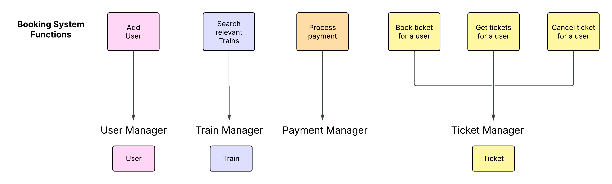
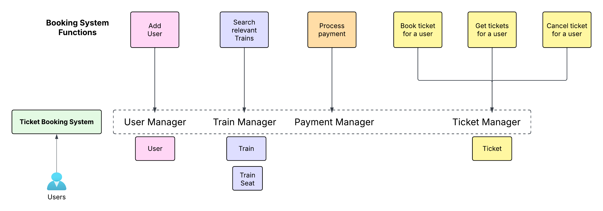
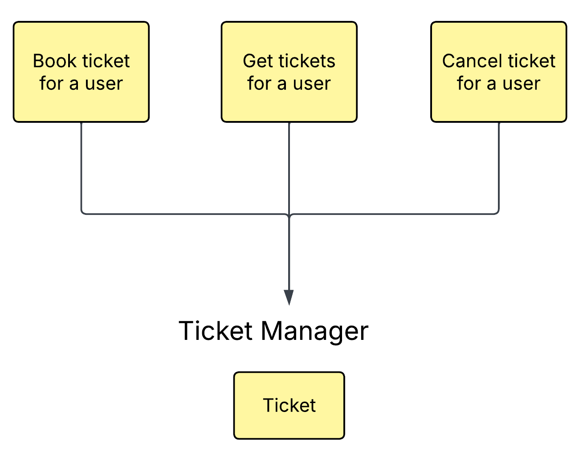
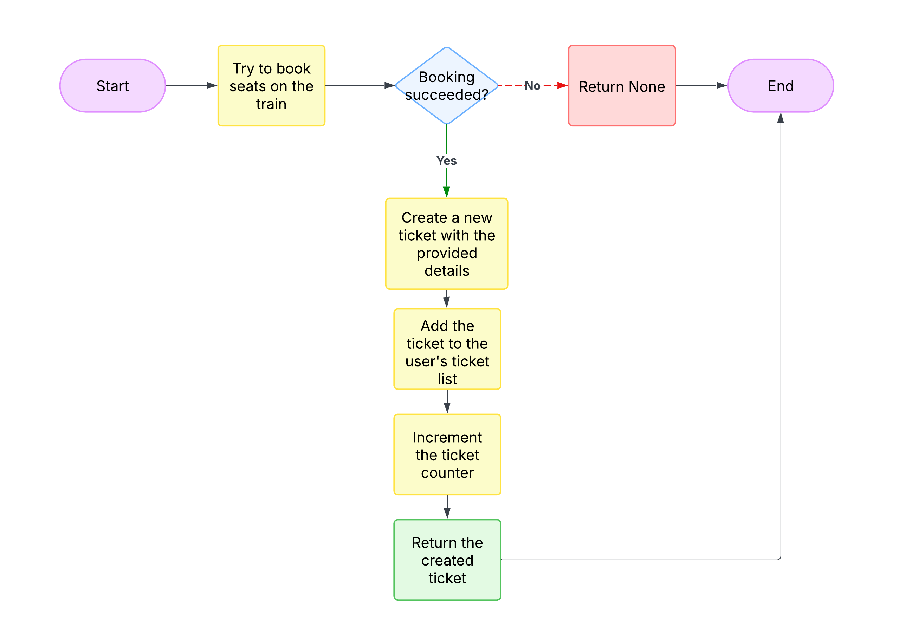
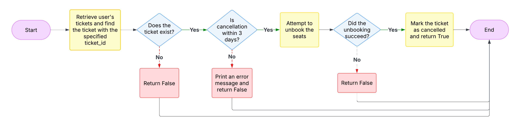
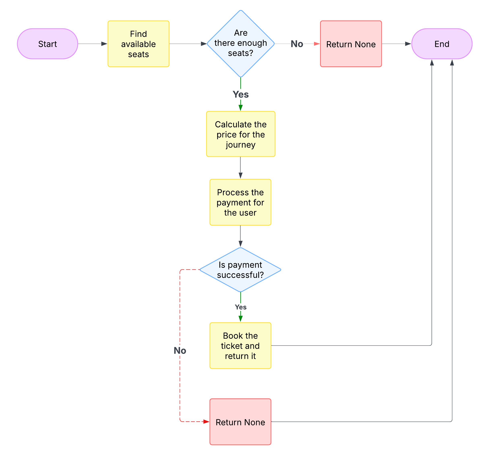
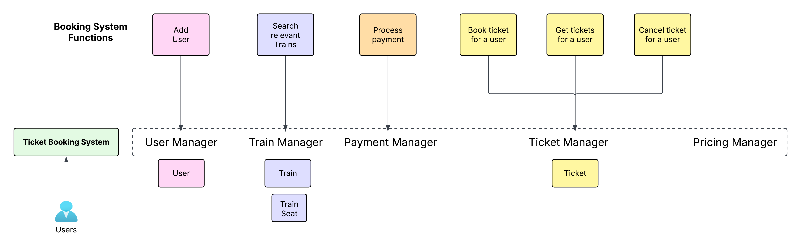

# Design Ticket Booking System

## User Flow Diagram



## Requirements

1. Users should be able to search for trains going from origin to destination at a particular time.
   For simplicity we assume all the trains run on all weekdays.
2. User should be able to book a particular train for any number of seats.
3. User should be able to view all upcoming and previous bookings.
4. User should be able to cancel a booking if it is before 3 days of departure.
5. [Extended Requirement] Users can choose between different train seat classes - Standard, Deluxe, etc.

### Use Cases

- User can signup on the booking system.
- User can search for trains based on origin, destination, and time.
- User can do the payment and book tickets for a particular train.
- User can view all bookings.
- User can cancel booking if it is 3 days before the departure.

## Procedure

### 1. Write down System Functions

Based on the user flow diagram, our system needs to have the following functions:



In this step, we identify the key functions our system needs to implement based on the user flow. Each user action requires a corresponding system function to handle it. This approach helps us ensure that we're covering all the functionality needed to support the user flow, and it gives us a clear picture of what our system needs to do.

### 2. Segregate the Functions into Different Managers

Now we'll organize these functions into logical managers based on their responsibilities:



### 3. Create a Main Manager to Manage All the Managers

The main manager (TicketBookingSystem) will coordinate between all other managers. The user interacts with the TicketBookingSystem, which then delegates tasks to the appropriate managers. This creates a clean separation of concerns and makes the system more maintainable.

Also, something to notice - Since UserManager class will be managing users we also need to create User class. Similarly for TicketManager and TrainManager. Do not worry about how TrainSeat class came into picture. You can skip it for now. We will introduce it later when we need that class.



### 4. Start Writing Code

#### User Manager

Let's start implementing our system, beginning with the simplest class 'UserManager'.

```
class UserManager:
    def __init__(self):
        # {user_id: User}
        self.users = {}
        self.user_counter = 1

    def add_user(self, name: str, email: str, phone: str) -> None:
        user = User(self.user_counter, name, email, phone)
        self.users[self.user_counter] = user
        self.user_counter += 1
        print(f"User {name} has been added successfully. User ID: {user.user_id}\n")

class User:
    def __init__(self, user_id: int, name: str, email: str, phone: str):
        self.user_id = user_id
        self.name = name
        self.email = email
        self.phone = phone
```

#### Train Manager

Now, let's try implementing TrainManager.  The main idea is to implement the methods we planned earlier (i.e. search_trains). So, for that we create a dictionary of trains from which we will search. But in order to search trains we first need to add trains in that dictionary. Now how do we do it? Well, we need to add another method 'add_train' for that. This method will simply initialize a new train and then add it to the 'trains' dictionary.

**Something to observe**: We created a new method 'add_train' only when we needed it. We never created a method beforehand. And that is the mentality one should have to write code clearly and complete the problem in an interview setting.

```
class Train:  
    def __init__(
        self,
        train_id: int,
        train_name: str,
        schedule: dict[str : (int, datetime.time)]
    ):
        self.train_id: int = train_id
        self.train_name: int = train_name
        # schedule: {location: (distance, time)}
        self.schedule: dict[str : (int, datetime.time)] = schedule
        self.origin: str = list(schedule.keys())[0]
        self.destination: str = list(schedule.keys())[-1]

class TrainManager:
    def __init__(self):
        self.trains: dict[int:Train] = {}

    def add_train(
        self,
        train_id: int,
        train_name: str,
        schedule: dict[str : (int, datetime.time)]
    ):
        train = Train(train_id, train_name, schedule)
        self.trains[train_id] = train
        print(f"Train {train_name} with ID {train_id} has been added successfully.\n")
```

We can now add 'search_trains' method.

```
    # Go through all the trains and return the trains
    # that have both origin and destination stops in their schedule
    # and the destination stop is after the origin stop  
    def search_trains(self, origin: str, destination: str):
        trains = []
        for train in self.trains.values():
            if (
                origin in train.schedule
                and destination in train.schedule
                and train.schedule[origin][0] < train.schedule[destination][0]
            ):
                trains.append(train)
        return trains
```

#### Payment Manager

Now, we can move on to implement 'PaymentManager'. Since, it is a big design for an interview setting and the focus is not on payments we can have a very simplified version for it. We will simply return True for all the cases.

Note: If the interviewer is interested in payments then only go ahead and implement it.

```
class PaymentManager:
    def process_payment(self, user_id: int, amount: float) -> bool:
        # For simplicity, we are assuming that the payment is successful
        print(f"Payment of {amount} processed for user {user_id}")
        return True
```

#### Ticket Manager

##### Ticket class

It's time to implement the 'TicketManager'. Since this class manages tickets, we first need to implement the `Ticket` class. Now, think of an actual ticket in your hand. What does it consist of? Train ID, Origin, Destination, Date of Journey, etc.

**Thing to remember:** Whenever you think about writing classes for real-world objects, visualize that object in real life. This approach makes writing code easier.


So, that's what we fill in this class.

```
class Ticket:
    def __init__(
        self,
        ticket_id: int,
        user_id: int,
        train_id: int,
        origin: str,
        destination: str,
        date_of_journey: datetime.date,
    ):
        self.ticket_id: int = ticket_id
        self.user_id: int = user_id
        self.train_id: int = train_id
        self.origin: str = origin
        self.destination: str = destination
        self.date_of_journey: datetime.date = date_of_journey
        self.ticket_status: str = "CONFIRMED"
```

Now, if you see the ticket, we have missed adding a very important thing there which is 'Seats'. So, let's add that to our Train class.

```
class Ticket:
    def init(
        ...
        date_of_journey: datetime.date,
	seats: List[TrainSeat],
    ):
        ...
        self.date_of_journey: datetime.date = date_of_journey
        self.ticket_status: str = "CONFIRMED"
	self.seats = seats
```

If you observe, we have used a class 'TrainSeat' for the seats. Now, we can go ahead and create that class. But where should we have it? Inside TrainManager file. This is because Seats are a part of train and Train class is written in TrainManager file.

##### TrainSeat class

```
class TrainSeat:
    def __init__(self, seat_id: int, train_id: int):
        self.seat_id = seat_id
        self.train_id = train_id
        self.__is_booked = False

    def book(self):
        self.__is_booked = True

    def unbook(self):
        self.__is_booked = False

    def is_booked(self):
        return self.__is_booked

class Train:
    def __init__(
        ....
```

**Something to observe**: We created a new class 'TrainSeat' only when we needed it. We never created it beforehand. And that is the mentality one should have to write code clearly and complete the problem in an interview setting.

Since, seats are a part of Trains we also need to make changes to our Train and TrainManager class. We need to add seats there.

```
class Train:
    def __init__(
        ...
        schedule: dict[str : (int, datetime.time)],
        seats: List[TrainSeat],
    ):
        ...
        self.destination: str = list(schedule.keys())[-1]
        self.seats: List[TrainSeat] = seats

class TrainManager:
    ...

    def add_train(
        ...
        schedule: dict[str : (int, datetime.time)],
        seats: List[TrainSeat],
    ):
        train = Train(train_id, train_name, schedule, seats)
        ...
```

##### Methods in TicketManager

Coming back to our TicketManager class now. What methods should we have in it? Well, we can answer that using the diagram we created earlier:



Let's start with method definitions for each of these:

```
class TicketManager:
    def __init__(self):
        # tickets is a dict which maps from user_id to all the tickets that user has booked
        # {user_id: [Ticket1, Ticket2, ...]}
        self.tickets = defaultdict(list)
        self.ticket_counter = 1

    def book_ticket(
        self,
        user_id: int,
        train_id: int,
        origin: str,
        destination: str,
        date_of_journey: datetime.date,
        seats: List[TrainSeat],
    ):
        pass

    def get_tickets(self, user_id):
        pass

    def cancel_ticket(self, user_id: int, ticket_id: int):
        pass
```

We can start filling in the `book_ticket` method. And for that I would recommend writing a pseudocode and then only start writing code. This is what I have in mind:

```
book_ticket:
1. Try to book seats on the train.
2. If booking fails, return None.
3. If booking succeeds:
   - Create a new ticket with the provided details.
   - Add the ticket to the user's ticket list.
   - Increment the ticket counter.
   - Return the created ticket.
```



And this is the code for it:

```
    def __init__(self, train_manager: TrainManager):
        ...
        self.train_manager = train_manager

    def book_ticket(
        self,
        user_id: int,
        train_id: int,
        origin: str,
        destination: str,
        date_of_journey: datetime.date,
        seats: List[TrainSeat],
    ):
        booking_success = self.train_manager.book_seats(seats)

        if not booking_success:
            print("Failed to book seats - Seats already booked\n")
            return None

        ticket = Ticket(
            self.ticket_counter,
            user_id,
            train_id,
            origin,
            destination,
            date_of_journey,
            seats,
        )
        self.tickets[user_id].append(ticket)
        self.ticket_counter += 1
        return ticket
```

The 1st step i.e. booking/reserving seats - Well that needs to be handled by TrainManager class so we will delegate that part to it. And we will add a small method in TrainManager for it:

```
class TrainManager:
    ...
    def search_trains(self, origin: str, destination: str):
        ...

    def book_seats(self, seats: List[TrainSeat]) -> bool:
        """
        Books the provided seats if all are available. This is an atomic operation -
        either all seats are booked or none.
        """
        # First check if all seats are available
        for seat in seats:
            if seat.is_booked():
                return False

        # If all seats are available, book them all
        for seat in seats:
            seat.book()
        return True
```

Let's continue implementing rest 2 methods in TicketManager. `get_tickets` is a simple one where we simply get all the tickets for that user using `tickets` dictionary we created earlier.

```
class TicketManager:
    def __init__(self, train_manager: TrainManager):
        # {user_id: [Ticket1, Ticket2, ...]}
        self.tickets = defaultdict(list)
        self.ticket_counter = 1
        self.train_manager = train_manager

    def book_ticket(
        ...

    def get_tickets(self, user_id):
        return self.tickets.get(user_id)
```

Now, let's try implementing `cancel_ticket`. Again for this we will write down the pseudocode and then only implement it.

```
cancel_ticket:
1. Retrieve the user's tickets and find the ticket with the specified ticket_id.
2. If the ticket exists:
   - Check if the cancellation is within 3 days of the journey.
     - If not, print an error message and return False.
   - Attempt to unbook the seats using the train manager.
     - If unbooking succeeds: Mark the ticket as cancelled and return True
     - If unbooking fails, return False.
3. If the ticket does not exist, return False.
```



And this is the code for it:

```
class TicketManager:
    ...
    def get_tickets(self, user_id):
        return self.tickets.get(user_id)

    def cancel_ticket(self, user_id: int, ticket_id: int):
        tickets = self.tickets[user_id]
        ticket = next(
            (ticket for ticket in tickets if ticket.ticket_id == ticket_id), None
        )
        if ticket:
            if (ticket.date_of_journey - datetime.now().date()).days < 3:
                print("Cannot cancel the ticket. Not within 3 days of journey.\n")
                return False

            unbooking_success = self.train_manager.unbook_seats(ticket.seats)
            if unbooking_success:
                ticket.set_cancelled_status()
                print(f"Ticket ID: {ticket_id} has been canceled.\n")
                return True
            else:
                print(f"Failed to cancel ticket ID: {ticket_id}\n")
                return False
        return False
```

If you notice we introduced 2 methods `self.train_manager.unbook_seats(ticket.seats)` and `ticket.set_cancelled_status()`. These are part of TrainManager and Ticket class. Similar to how we created method for booking seats in TrainManager we need to create a method for unbooking seats there. The reason being the same - Booking/Reserving seats in a train is TrainManager's responsibility. Here's a simple implementation for it:

```
class TrainManager:
    ...

    def book_seats(self, seats: List[TrainSeat]) -> bool:
        ...

    def unbook_seats(self, seats: List[TrainSeat]) -> bool:
        for seat in seats:
            seat.unbook()
        return True

```

Now, for `ticket.set_cancelled_status()` we go to our Ticket class:

```
class Ticket:
    def __init__(
        ...
        self.seats: List[TrainSeat] = seats
        self.ticket_status: str = "CONFIRMED"

    def set_cancelled_status(self):
        self.ticket_status = "CANCELLED"
```

This ends the implementation of all the classes we planned earlier.

### 5. TicketBookingSystem

Now, lets implement Step 3 i.e. creating a main manager to manage all these managers (TicketManager, TrainManager, etc.). We will call this as `TicketBookingSystem`. The user interacts with the `TicketBookingSystem`, which then delegates tasks to the appropriate managers. This creates a clean separation of concerns and makes the system more maintainable.


Now, let's start with a very basic implementation with the TicketBookingSystem calling different managers within its methods. We have implemented all of the methods except the `book_ticket` here. We will cover that later.

```
class TicketBookingSystem:
    def __init__(self):
        self.user_manager = UserManager()
        self.train_manager = TrainManager()
        self.ticket_manager = TicketManager(self.train_manager)
        self.payment_manager = PaymentManager()

    def add_user(self, name: str, email: str, phone: str) -> None:
        self.user_manager.add_user(name, email, phone)

    def add_train(
        self,
        train_id: int,
        train_name: str,
        schedule: Dict[str, Tuple[int, datetime.time]],
        total_seats: int,
    ) -> None:
        self.train_manager.add_train(train_id, train_name, schedule, total_seats)

    def search_trains(self, origin: str, destination: str) -> List[Train]:
        return self.train_manager.search_trains(origin, destination)

    def book_ticket(
        self,
        user_id: int,
        train_id: int,
        origin: str,
        destination: str,
        date_of_journey: datetime.date,
        seats_required: int,
    ) -> Optional[Ticket]:
        pass

    def get_tickets(self, user_id: int) -> Optional[List[Ticket]]:
        return self.ticket_manager.get_tickets(user_id)

    def cancel_ticket(self, user_id: int, ticket_id: int) -> bool:
        return self.ticket_manager.cancel_ticket(user_id, ticket_id)

```

In the above code we have called `self.train_manager.add_train(train_id, train_name, schedule, total_seats)` where `total_seats` is an integer but the current definition of `train_manager.add_train()` takes in `seats: List[TrainSeat]`. So, let's go ahead and fix that.

```
class TrainManager:
    def __init__(self):
        self.trains: dict[int:Train] = {}

    def add_train(
        self,
        train_id: int,
        train_name: str,
        schedule: dict[str : (int, datetime.time)],
        total_seats: int,
    ):
        seats = [TrainSeat(i, train_id) for i in range(1, total_seats+1)]
        train = Train(train_id, train_name, schedule, seats)
        self.trains[train_id] = train
        print(f"Train {train_name} with ID {train_id} has been added successfully.\n")
```

Now, let's cover `book_ticket` . Let's first write down a basic pseudocode for it.

```
1. Find available seats  
    1.1 If less seats are available, return None  
2. Calculate the price for the journey based on the train, origin, destination
3. Process the payment for the user  
    3.1 If payment is successful, book the ticket and return it  
    3.2 If payment fails, return None
```



Now, a few questions arise:

* How do we find available seats? And whose responsibility should it be?
  * Train Objects maintain seats. So we can iterate through all those seats and check how many are available. And that is why we can give this responsibility to Train Manager.
* How do we calculate the price of a journey? And whose responsibility should it be?
  * Price can be calculated in many different ways but here we will do a simple implementation where we have a fixed cost and a dynamic cost per km. We will dive more deeper into it pretty soon.
  * Now, whose reponsibility should it be? We can create another manager 'PricingManager' to handle this. We can also take the route of having just a method `calculate_price` but since I expect future changes in price calculation (besed on seat types) I will go forward with having a new manager class.

Let's see all of the code changes for these:

1. TicketBookingSystem: We first write the `book_ticket` method according to our flow chart. Here we have assumed different methods like
   `train_manager.find_available_seats`, and `pricing_manager.calculate_price`.

```
class TicketBookingSystem:
    ...

    def search_trains(self, origin: str, destination: str) -> List[Train]:
        ...

    def book_ticket(
        self,
        user_id: int,
        train_id: int,
        origin: str,
        destination: str,
        date_of_journey: datetime.date,
        seats_required: int,
    ) -> Optional[Ticket]:
        final_seats = self.train_manager.find_available_seats(train_id, seats_required)
        if not final_seats:
            print("Seats are not available. Ticket booking failed.\n")
            return None

        price = self.pricing_manager.calculate_price(
            train_id, origin, destination, seats_required
        )

        if self.payment_manager.process_payment(user_id, price):
            ticket = self.ticket_manager.book_ticket(
                user_id, train_id, origin, destination, date_of_journey, final_seats
            )
            print(f"Ticket booked successfully. Ticket ID: {ticket.ticket_id}\n")
            return ticket

        print("Payment failed. Ticket booking failed.\n")
        return None

    ...
```

2. `train_manager.find_available_seats`:

```
class Train:
    ...

    def find_available_seats(self, seats_required: int) -> List[TrainSeat]:
        available_seats = []
        for seat in self.seats:
            if not seat.is_booked():
                available_seats.append(seat)
            if len(available_seats) == seats_required:
                return available_seats
        return None

class TrainManager:
    ...

    def find_available_seats(self, train_id: int, seats_required: int) -> List[TrainSeat]:
    	return self.trains[train_id].find_available_seats(seats_required)

```

3. `pricing_manager.calculate_price`:

```
class PricingManager:
    def __init__(self, train_manager: TrainManager):
        self.train_manager = train_manager
        self.fixed_price = 100
        self.dynamic_price_per_km = 1

    def calculate_price(
        self,
        train_id: int,
        origin: str,
        destination: str,
        required_seats: int,
    ) -> int:
        distance = self.train_manager.get_train(train_id).get_distance(
            origin, destination
        )

        total_price_per_seat = self.fixed_price + (self.dynamic_price_per_km * distance)
        return total_price_per_seat * required_seats

```



For calculating price we also need to implement a method in Train class known as `get_distance` which will return distance between 2 places. Along with that we also need `get_train` method in TrainManager.

```
class Train:
    ...

    def get_distance(self, origin: str, destination: str):
        return self.schedule[destination][0] - self.schedule[origin][0]

class TrainManager:
    ...
  
    def get_train(self, train_id: int) -> Train:
        return self.trains.get(train_id)
```

Also, let's update our TicketBookingSystem's initialization to include the PricingManager:

```python
class TicketBookingSystem:
    def __init__(self):
        self.user_manager = UserManager()
        self.train_manager = TrainManager()
        self.payment_manager = PaymentManager()
        self.pricing_manager = PricingManager(self.train_manager)
        self.ticket_manager = TicketManager(self.train_manager)
  
    ...
```

This completes our implementation. Now let's test things out using our main class.

### 6. Test using Main class

```python
from datetime import datetime, time, date, timedelta

def main():
    # Create the ticket booking system
    booking_system = TicketBookingSystem()
  
    # Add users
    booking_system.add_user("Alice", "alice@example.com", "1234567890")
    booking_system.add_user("Bob", "bob@example.com", "0987654321")
  
    # Add trains with schedules
    # Schedule format: {location: (distance_from_origin, arrival_time)}
    train1_schedule = {
        "New York": (0, time(hour=6, minute=0)),
        "Philadelphia": (150, time(hour=7, minute=30)),
        "Washington DC": (350, time(hour=9, minute=0))
    }
  
    train2_schedule = {
        "Boston": (0, time(hour=8, minute=0)),
        "New York": (220, time(hour=10, minute=30)),
        "Philadelphia": (370, time(hour=12, minute=0)),
        "Washington DC": (570, time(hour=14, minute=0))
    }
  
    booking_system.add_train(101, "Express Northeast", train1_schedule, 50)
    booking_system.add_train(102, "Regional Express", train2_schedule, 100)
  
    # Search for trains
    print("Searching for trains from New York to Washington DC:")
    trains = booking_system.search_trains("New York", "Washington DC")
    for train in trains:
        print(f"Found train: {train.train_name} (ID: {train.train_id})")
  
    # Book tickets
    journey_date = date.today() + timedelta(days=10)
    ticket1 = booking_system.book_ticket(
        user_id=1, 
        train_id=101, 
        origin="New York", 
        destination="Washington DC", 
        date_of_journey=journey_date, 
        seats_required=2
    )
  
    # View bookings
    print("\nViewing tickets for user 1:")
    user_tickets = booking_system.get_tickets(1)
    if user_tickets:
        for ticket in user_tickets:
            print(f"Ticket ID: {ticket.ticket_id}, Train: {ticket.train_id}, " 
                  f"From: {ticket.origin}, To: {ticket.destination}, "
                  f"Date: {ticket.date_of_journey}, Status: {ticket.ticket_status}")
  
    # Cancel a ticket
    print("\nCancelling ticket:")
    if ticket1:
        booking_system.cancel_ticket(1, ticket1.ticket_id)
  
        # View bookings again
        print("\nViewing tickets for user 1 after cancellation:")
        user_tickets = booking_system.get_tickets(1)
        if user_tickets:
            for ticket in user_tickets:
                print(f"Ticket ID: {ticket.ticket_id}, Train: {ticket.train_id}, "
                      f"From: {ticket.origin}, To: {ticket.destination}, "
                      f"Date: {ticket.date_of_journey}, Status: {ticket.ticket_status}")

if __name__ == "__main__":
    main()
```
